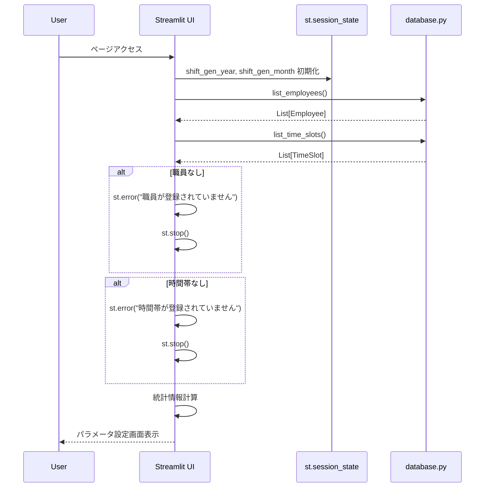
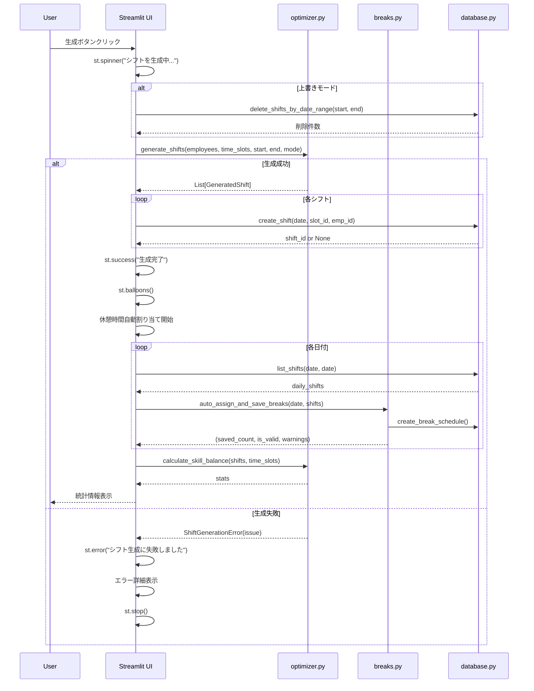
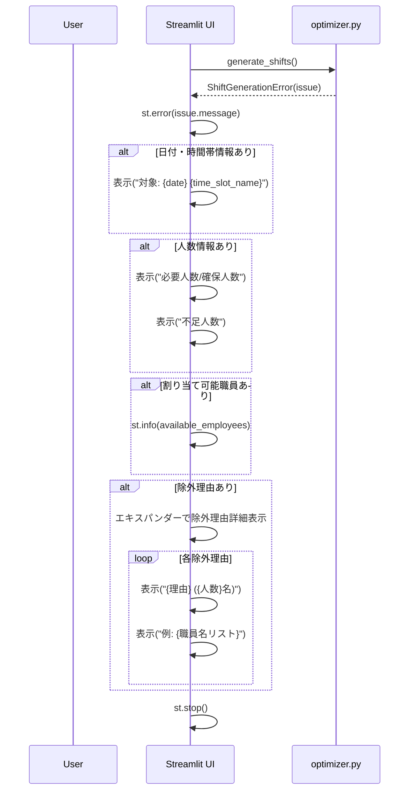

# シフト生成画面 詳細設計書

## 1. 画面概要

### 1.1 目的
職員の勤務可否、スキルスコア、職員タイプを考慮して、最適化されたシフトを自動生成する画面。

**最適化の重点**:
- **スキル能力の平均化**: 各時間帯に配置される職員のスキル能力を均等化し、日によって能力が偏らないようにする
- **医事能力の優先**: 受付業務では医事能力（保険登録、会計など）を優先的に評価
- **勤務回数の均等化**: 特定の職員への負担集中を防止

### 1.2 画面パス
- **ファイルパス**: `pages/3_🎯_シフト生成.py`
- **URL**: `/3_🎯_シフト生成`（Streamlitのページルーティング）

### 1.3 画面構成
- 現在の状況表示エリア
- 生成パラメータ設定エリア（年月選択、期間選択、最適化モード）
- 生成・リセットボタン
- 生成結果表示エリア（統計情報）
- サイドバー: ヘルプ情報

### 1.4 設計思想
- **最適化エンジン**: 職員タイプ制約、スキルバランス、勤務回数均等化を考慮
- **3つの最適化モード**: バランス、スキル重視、日数重視
- **自動休憩割り当て**: シフト生成後、受付職員の休憩時間を自動割り当て
- **終日勤務の原則**: 半休（午前休・午後休）でない限り、午前のみまたは午後のみの勤務は行わず、終日勤務形態に応じた勤務をする
- **休憩時間の基本原則**: 正職員は基本的に2時間連続で休憩を取得するが、忙しい日は分割することもあり（当日の判断）

---

## 2. データモデル

### 2.1 GeneratedShift（生成済みシフト）エンティティ

最適化エンジンが生成する一時的なオブジェクト（DBへの保存前）。

#### プロパティ

| 項目名 | 型 | 必須 | 説明 |
|--------|-----|------|------|
| date | str | ○ | 日付（YYYY-MM-DD） |
| time_slot_id | str | ○ | 時間帯ID |
| employee_id | int | ○ | 職員ID |
| employee_name | str | ○ | 職員名 |
| time_slot_name | str | ○ | 時間帯表示名 |
| start_time | str | ○ | 開始時刻（HH:MM） |
| end_time | str | ○ | 終了時刻（HH:MM） |
| skill_score | int | ○ | スキルスコア |
| employee | Employee | ○ | 職員オブジェクト |
| time_slot | TimeSlot | ○ | 時間帯オブジェクト |

### 2.2 Shift（保存済みシフト）エンティティ

DBに永続化されるシフトデータ。

#### プロパティ

| 項目名 | 型 | 必須 | 制約 | 説明 |
|--------|-----|------|------|------|
| id | int | ○ | PRIMARY KEY | シフトID（自動採番） |
| date | str | ○ | DATE | 日付 |
| time_slot_id | str | ○ | FK | 時間帯ID |
| employee_id | int | ○ | FK | 職員ID |
| created_at | datetime | ○ | - | 作成日時 |

#### ユニーク制約

```sql
UNIQUE(date, time_slot_id, employee_id)
```

同一日の同一時間帯に同一職員を重複割り当て不可。

### 2.3 ShiftGenerationIssue（生成エラー情報）

シフト生成失敗時の詳細情報。

#### プロパティ

| 項目名 | 型 | 説明 |
|--------|-----|------|
| code | str | エラーコード（insufficient_staff等） |
| message | str | エラーメッセージ |
| date | Optional[str] | 問題が発生した日付 |
| time_slot_id | Optional[str] | 問題が発生した時間帯ID |
| time_slot_name | Optional[str] | 時間帯表示名 |
| required | Optional[int] | 必要人数 |
| available | Optional[int] | 確保できた人数 |
| shortage | Optional[int] | 不足人数 |
| available_employees | List[str] | 割り当て可能と判断された職員名 |
| rejections | List[RejectionSummary] | 除外理由の集計 |

### 2.4 RejectionSummary（除外理由集計）

#### プロパティ

| 項目名 | 型 | 説明 |
|--------|-----|------|
| reason | str | 除外理由 |
| count | int | 該当人数 |
| examples | List[str] | 例（職員名、最大5名） |

---

## 3. 画面レイアウト

### 3.1 現在の状況表示エリア

**3カラムレイアウト**

| カラム | メトリック名 | 計算式 |
|--------|------------|--------|
| 1 | 登録職員数 | list_employees()の件数 |
| 2 | 時間帯数 | list_time_slots()の件数 |
| 3 | 平均スキル | 全職員の4項目スキル平均値の平均 |

### 3.2 生成パラメータ設定エリア

#### 3.2.1 年月選択（月単位で選択の場合）

**4カラムレイアウト（比率: 1:3:3:1）**

| カラム | 項目 | タイプ | 機能 |
|--------|------|--------|------|
| 1 | ◀ | button | 前月へ移動 |
| 2 | 年 | selectbox | 年選択（現在年-1〜現在年+2） |
| 3 | 月 | selectbox | 月選択（1〜12） |
| 4 | ▶ | button | 次月へ移動 |

**セッション状態**:
- `shift_gen_year`: 選択中の年
- `shift_gen_month`: 選択中の月

#### 3.2.2 期間選択方法

**ラジオボタン**:
- 月単位で選択（デフォルト）
- 日付範囲で指定

**月単位で選択の場合**:
- `get_month_range(year, month)` で20日締めの期間を取得

**日付範囲で指定の場合**:
- 開始日: date_input（デフォルト: 今日）
- 終了日: date_input（デフォルト: 今日+30日）

#### 3.2.3 最適化モード選択

**セレクトボックス**:

| 内部値 | 表示ラベル | 説明 |
|--------|-----------|------|
| balance | ⚖️ バランス（勤務回数とスキルの両方を考慮） | 推奨、最もバランスの取れた結果 |
| skill | 🎯 スキル重視（目標スキルスコアに近づける） | 特定の時間帯に高スキル職員が必要な場合 |
| days | 📅 日数重視（勤務回数の均等化を優先） | 公平性を最優先する場合 |

**デフォルト**: balance

#### 3.2.4 最適化の目標

##### スキル能力の平均化（能力の均等化）

**主要目標**: それぞれの時間帯において、配置される職員のスキル能力を平均化する。特に受付業務では医事能力を優先する。

- **リハ室**: リハ室スキル + 総合対応力の平均を目標値に近づける
- **受付（午前）**: 受付午前スキル（医事能力優先） + 総合対応力の平均を目標値に近づける
- **受付（午後）**: 受付午後スキル（医事能力優先） + 総合対応力の平均を目標値に近づける

**目標**: 
- 日によって能力が偏らないよう、各時間帯の職員スキルレベルを均一化
- 特定の日だけスキルの高い職員が集中することを避ける
- 各時間帯で安定したサービス品質を提供
- 医事能力の高い職員を優先的に配置

**最適化アルゴリズム**:
```
目標値 = 全職員の該当スキルの平均値

各日の配置について:
  実際の配置スキル平均 ≈ 目標値
  ただし、受付業務では医事能力を優先
  
最小化: Σ(各日の配置スキル平均 - 目標値)²
```

#### 3.2.5 その他オプション

**チェックボックス**:
- **既存のシフトを上書きする**: デフォルトON
  - チェック時: 指定期間の既存シフトを削除してから新規生成

### 3.3 生成・リセットボタン

**2カラムレイアウト（比率: 3:1）**

| カラム | ボタン | タイプ | 機能 |
|--------|--------|--------|------|
| 1 | 🚀 シフトを生成 | primary | シフト生成処理を実行 |
| 2 | 🔄 リセット | normal | ページリロード |

### 3.4 生成結果表示エリア

#### 3.4.1 統計情報（4カラムレイアウト）

| カラム | メトリック名 | 説明 |
|--------|------------|------|
| 1 | 平均スキル合計 | 各時間帯のスキル合計の平均値 |
| 2 | 標準偏差 | スキル合計のばらつき |
| 3 | 最小値 | 最も低い時間帯のスキル合計 |
| 4 | 最大値 | 最も高い時間帯のスキル合計 |

#### 3.4.2 評価メッセージ

| 条件 | メッセージ | タイプ |
|------|-----------|--------|
| 標準偏差 < 10 | 🌟 スキルバランスが非常に良好です！ | success |
| 標準偏差 < 20 | ✨ スキルバランスは良好です | info |
| 標準偏差 >= 20 | ⚠️ スキルにやや偏りがあります | warning |

---

## 4. データフロー

### 4.1 画面初期表示フロー



### 4.2 シフト生成フロー



### 4.3 エラーハンドリングフロー



---

## 5. ビジネスロジック

### 5.1 最適化エンジンの動作

#### 5.1.1 入力バリデーション

```python
def _validate_shift_inputs(employees, time_slots, start_date, end_date):
    if not employees:
        raise ShiftGenerationError("職員が登録されていません。")
    if not time_slots:
        raise ShiftGenerationError("時間帯が登録されていません。")
    if end_date < start_date:
        raise ShiftGenerationError("終了日は開始日以降の日付を指定してください。")
```

#### 5.1.2 日次処理ループ

```python
current = start_date
while current <= end_date:
    date_str = current.strftime("%Y-%m-%d")
    weekday = current.weekday()
    daily_slots = all_slots_by_day.get(weekday, [])
    
    # 午前→午後の順で処理
    morning_slots = [s for s in daily_slots if s.period == "morning"]
    afternoon_slots = [s for s in daily_slots if s.period == "afternoon"]
    
    # 午前の処理 → 午後の処理（午前勤務者を優先的に午後にも配置）
    # パートタイムルールの検証
    
    current += timedelta(days=1)
```

#### 5.1.3 職員割り当てロジック

**3つの最適化モード**:

| モード | アルゴリズム | 選択基準 |
|--------|------------|---------|
| days | 勤務日数最小の職員を優先 | `min(work_count[e.id])` |
| skill | 目標スキルスコアに近い職員を優先 | `min(abs(score - target))` |
| balance | 勤務日数最小の中からスキル最適を選択 | 組み合わせ |

**午後時間帯の優先ロジック**:
```python
if slot.period == "afternoon" and morning_workers:
    afternoon_capable = [e for e in available if e.id in morning_workers]
    if afternoon_capable:
        # 午前勤務者を優先的に割り当て
        selected = _select_employees_for_slot(afternoon_capable, ...)
```

#### 5.1.4 制約チェック

**職員タイプ制約**:
```python
def _can_assign_to_area(employee, time_slot):
    if time_slot.area == "リハ室":
        if employee.employee_type not in {"TYPE_A", "TYPE_C", "TYPE_D"}:
            return False
        return employee.skill_reha > 0
    
    if time_slot.area == "受付":
        if employee.employee_type not in {"TYPE_A", "TYPE_B"}:
            return False
        return employee.skill_reception_am > 0 or employee.skill_reception_pm > 0
    
    return True
```

**勤務可否チェック**:
```python
# 1. 日曜日チェック
# 2. 休暇登録チェック（employee_absences）
# 3. 勤務形態チェック（employment_patterns の時間範囲）
# 4. 時間重複チェック（同日の別シフトとの重複）
```

**パートタイムルール**:
```python
# リハ室でTYPE_D（パート）のみの場合はエラー
# 必ずTYPE_AまたはTYPE_Cを同じ時間帯に配置
```

### 5.2 スキルスコア計算

```python
def calculate_skill_score(employee, time_slot):
    """職員のスキルスコアを計算する。
    
    受付業務では医事能力（保険登録、会計など）を優先的に評価する。
    各時間帯のスキルスコアを均等化することで、日によるサービス品質の
    偏りを防止する。
    """
    general = employee.skill_general
    
    if time_slot.area == "リハ室":
        return employee.skill_reha + general
    
    if time_slot.area == "受付":
        # 受付スキルには医事能力（保険登録、会計など）が含まれる
        if time_slot.period == "morning":
            return employee.skill_reception_am + general
        if time_slot.period == "afternoon":
            return employee.skill_reception_pm + general
    
    return general
```

### 5.3 休憩時間自動割り当て

**休憩時間の基本原則**:
- 正職員は基本的に2時間連続で休憩を取得
- 忙しい日は分割することもあり（当日の判断）
- 受付職員が休憩中も窓口には必要な人数が常駐（午前4-5名、午後3名）
- 休憩は交代制で取得（同時に複数名が休憩に入らない）

```python
def auto_assign_and_save_breaks(date, shifts):
    """受付職員の休憩時間を自動割り当てする。
    
    正職員は基本的に2時間連続で休憩を取得するが、
    忙しい日は分割することもある（当日の判断）。
    """
    # 1. 受付職員のシフトのみ抽出
    reception_shifts = [s for s in shifts if s.area == "受付"]
    
    # 2. 最低3名必要（常時2名確保のため）
    if len(reception_shifts) < 3:
        return (0, True, ["受付職員が3名未満のためスキップ"])
    
    # 3. カバレッジ制限: 総人数 - 2（窓口に必要な人数を確保）
    coverage_limit = len(reception_shifts) - 2
    
    # 4. 優先窓口: 11:00-12:00, 12:00-13:00, 13:00-14:00
    
    # 5. 職員ごとに勤務パターンから必要な休憩窓数を取得
    #    正職員B/C（月火金）と通常/△（水曜）: 基本2時間連続（120分）
    #    正職員A（月火金）と◯（水曜）: 60分
    #    時短勤務・パート午後まで: 60分
    
    # 6. 各窓口に割り当て（カバレッジ制限を超えないように）
    #    正職員の2時間休憩は基本的に連続する2窓口に割り当て
    
    return (saved_count, is_valid, warnings)
```

### 5.4 統計計算

**スキル能力の平均化の評価**:
- 各時間帯のスキル合計の標準偏差が小さいほど、能力が均等化されている
- 標準偏差 < 10: 非常に良好なバランス
- 標準偏差 < 20: 良好なバランス
- 標準偏差 >= 20: やや偏りあり

```python
def calculate_skill_balance(shifts, time_slots):
    """スキルバランスの統計を計算する。
    
    各時間帯のスキル合計を計算し、その平均値と標準偏差を算出する。
    標準偏差が小さいほど、日によるスキル能力の偏りが少なく、
    安定したサービス品質が提供できることを示す。
    """
    # 時間帯ごとのスキル合計を計算
    slot_totals = {}
    for shift in shifts:
        slot_totals[shift.time_slot_id] += shift.skill_score
    
    # 統計値計算
    scores = list(slot_totals.values())
    average = sum(scores) / len(scores)
    variance = sum((s - average)**2 for s in scores) / len(scores)
    std_dev = sqrt(variance)
    
    return {
        "avg_skill": average,
        "std_skill": std_dev,
        "min_skill": min(scores),
        "max_skill": max(scores),
        "balance_score": std_dev / average if average > 0 else 0.0
    }
```

---

## 6. UI/UXの詳細

### 6.1 進行状況の表示

| フェーズ | 表示方法 | メッセージ |
|---------|---------|-----------|
| シフト生成中 | st.spinner | "🔄 シフトを生成中..." |
| 休憩割り当て中 | st.spinner | "⏰ 休憩時間を自動割り当て中..." |
| 生成完了 | st.success + st.balloons | "✅ シフト生成完了！ {件数}件のシフトを作成しました" |

### 6.2 メッセージ表示

#### 6.2.1 成功メッセージ

| タイプ | メッセージ |
|--------|-----------|
| シフト生成成功 | "✅ シフト生成完了！ {success_count}件のシフトを作成しました" |
| 休憩割り当て成功 | "✅ 休憩時間を {total_break_count}件割り当てました" |
| 既存シフト削除 | "🗑️ 既存のシフト {deleted}件を削除しました" |

#### 6.2.2 警告メッセージ

| タイプ | メッセージ |
|--------|-----------|
| 重複保存失敗 | "⚠️ {failed_count}件のシフトが重複のため保存されませんでした" |
| 職員数不足 | "⚠️ 職員数({人数}名)が時間帯の最大必要人数({人数}名)より少ない可能性があります" |

#### 6.2.3 エラーメッセージ

| タイプ | メッセージ |
|--------|-----------|
| 職員未登録 | "❌ 職員が登録されていません" |
| 時間帯未登録 | "❌ 時間帯が登録されていません" |
| 生成失敗 | "❌ シフト生成に失敗しました" |

### 6.3 エラー詳細表示

**エキスパンダー構成**:

1. **基本情報**:
   - 対象: `{date} {time_slot_name}`
   - 必要人数: `{required}名 / 確保できた人数: {available}名`
   - 不足人数: `{shortage}名`

2. **割り当て可能職員**（infoボックス）:
   - "割り当て可能と判断された職員: {名前リスト}"

3. **除外理由詳細**（エキスパンダー）:
   ```
   {除外理由} ({人数}名)
   例: {職員名1}, {職員名2}, ...
   ```

### 6.4 インタラクション

#### 6.4.1 生成ボタンの動作

1. ボタンクリック
2. スピナー表示開始
3. バリデーション → エラー時は即座にst.stop()
4. 既存シフト削除（オプション）
5. 最適化実行
6. DB保存
7. 休憩割り当て
8. 統計表示
9. バルーンアニメーション

#### 6.4.2 リセットボタンの動作

- クリック時: `st.rerun()` でページ全体をリロード

---

## 7. データベース操作

### 7.1 使用する関数

| 関数名 | モジュール | 用途 | 引数 | 戻り値 |
|--------|----------|------|------|--------|
| list_employees | database.py | 職員一覧取得 | active_only: bool | List[Employee] |
| list_time_slots | database.py | 時間帯一覧取得 | active_only: bool | List[TimeSlot] |
| delete_shifts_by_date_range | database.py | シフト一括削除 | start_date: str, end_date: str | int（削除件数） |
| create_shift | database.py | シフト作成 | date: str, time_slot_id: str, employee_id: int | Optional[int] |
| list_shifts | database.py | シフト一覧取得 | start_date: str, end_date: str | List[dict] |
| generate_shifts | optimizer.py | シフト最適化 | employees, time_slots, start, end, mode | List[GeneratedShift] |
| calculate_skill_balance | optimizer.py | スキル統計計算 | shifts, time_slots | dict |
| auto_assign_and_save_breaks | breaks.py | 休憩自動割り当て | date: str, shifts: List[dict] | Tuple[int, bool, List[str]] |
| get_month_range | utils.py | 月次期間取得 | year: int, month: int | Tuple[str, str] |

### 7.2 トランザクション

#### シフト削除
```python
delete_shifts_by_date_range(start_date, end_date)
# 単一DELETE文、自動コミット
```

#### シフト作成
```python
# ループ内で個別にINSERT
for payload in shift_payloads:
    shift_id = create_shift(date, time_slot_id, employee_id)
    # 各INSERTは独立したトランザクション
    # 重複エラー時はNoneを返す（例外は発生しない）
```

#### 休憩作成
```python
# breaks.py内で以下を実行:
# 1. DELETE（該当日の既存休憩）
# 2. INSERT（新規休憩）× N件
# 各操作は独立したトランザクション
```

### 7.3 データ整合性

#### ユニーク制約
```sql
-- shifts テーブル
UNIQUE(date, time_slot_id, employee_id)
```

**影響**: 重複シフトは`create_shift()`がNoneを返す

#### 外部キー制約
```sql
FOREIGN KEY (time_slot_id) REFERENCES time_slots(id)
FOREIGN KEY (employee_id) REFERENCES employees(id)
```

**影響**: 時間帯・職員削除時にシフトも自動削除（CASCADE）

---

## 8. エラーハンドリング

### 8.1 事前チェック

| チェック項目 | 条件 | 動作 |
|------------|------|------|
| 職員登録なし | len(employees) == 0 | st.error() → st.stop() |
| 時間帯登録なし | len(time_slots) == 0 | st.error() → st.stop() |
| 職員数不足 | len(employees) < max_required | st.warning()（継続可能） |

### 8.2 生成エラー

**ShiftGenerationError**:
- **insufficient_staff**: 必要人数を確保できない
- **selection_failed**: 割り当てに失敗
- **part_time_rule**: パートタイムルール違反
- **no_employees**: 職員なし
- **no_time_slots**: 時間帯なし
- **invalid_range**: 日付範囲不正

**エラー時の動作**:
1. `st.error(issue.message)` で主要メッセージ表示
2. 詳細情報を構造化して表示
3. `st.stop()` で処理中断

### 8.3 保存エラー

**重複エラー**:
- `create_shift()` がNoneを返す
- カウントして警告表示（エキスパンダーで詳細）
- 処理は継続（他のシフトは保存される）

---

## 9. パフォーマンス

### 9.1 処理時間の目安

| 規模 | 処理時間 |
|------|---------|
| 5名 × 30日 | 数秒〜10秒 |
| 10名 × 30日 | 10秒〜30秒 |

### 9.2 最適化手法

#### データ取得
- 職員・時間帯は1回のクエリで全件取得
- 日付ごとのループで個別クエリは発行しない

#### アルゴリズム
- 曜日別の時間帯をあらかじめ辞書化
- 勤務回数カウントをメモリ上で管理（`work_count: Dict[int, int]`）
- 午前勤務者のIDリストを保持して午後の検索を高速化

#### DB書き込み
- 各シフトを個別にINSERT（トランザクション分離）
- バッチINSERTは使用しない（エラーハンドリングのため）

---

## 10. セキュリティ

### 10.1 入力バリデーション

- 日付範囲: Streamlitの`date_input`が妥当性を保証
- 最適化モード: セレクトボックスで選択肢を制限
- 職員・時間帯: DBから取得したデータのみ使用

### 10.2 SQLインジェクション対策

- パラメータ化クエリを使用（database.py内で実装）
- ユーザー入力を直接SQL文に含めない

---

## 11. テスト観点

### 11.1 機能テスト

| テストケース | 入力 | 期待結果 |
|------------|------|---------|
| 正常生成（balance） | 職員5名、30日間 | 生成成功、統計表示 |
| 正常生成（skill） | 職員5名、30日間 | スキル重視で生成 |
| 正常生成（days） | 職員5名、30日間 | 勤務日数均等化 |
| 上書きモード | 既存シフトあり | 削除→生成 |
| 上書きなし | 既存シフトあり | 重複エラー |
| 職員数不足 | 職員1名、必要2名 | エラーメッセージ表示 |
| 休暇考慮 | 全職員が休暇 | エラーメッセージ表示 |
| 休憩割り当て | 受付職員3名以上 | 休憩自動割り当て |

### 11.2 UIテスト

| テストケース | 操作 | 期待結果 |
|------------|------|---------|
| 年月移動 | 矢印ボタンクリック | 前月/次月に移動 |
| 期間選択切替 | ラジオボタン変更 | 入力フォーム切替 |
| 生成進行表示 | 生成ボタンクリック | スピナー表示 |
| 成功時アニメーション | 生成成功 | バルーン表示 |
| エラー詳細展開 | エキスパンダークリック | 除外理由表示 |

### 11.3 最適化アルゴリズムテスト

| テストケース | 条件 | 期待結果 |
|------------|------|---------|
| スキルバランス | balance モード | 標準偏差が最小化 |
| 勤務日数均等化 | days モード | work_count が均等 |
| 午後優先割り当て | 午前勤務者あり | 午前勤務者が午後も割り当て |
| パートタイムルール | TYPE_Dのみ配置 | エラー発生 |
| 職員タイプ制約 | TYPE_Bをリハ室に | 除外される |

### 11.4 パフォーマンステスト

| テストケース | 条件 | 期待結果 |
|------------|------|---------|
| 小規模 | 5名×30日 | 10秒以内 |
| 中規模 | 10名×30日 | 30秒以内 |
| 大規模 | 15名×30日 | 60秒以内 |

---

## 12. 今後の拡張予定

### 12.1 機能追加候補

- [ ] 生成進捗のプログレスバー表示
- [ ] 生成結果のプレビュー（保存前確認）
- [ ] 一部日付のみ再生成機能
- [ ] 特定職員の固定シフト設定
- [ ] 連続勤務日数の制限
- [ ] 休日前後の配慮設定
- [ ] 生成履歴の保存・復元
- [ ] 複数パターンの生成と比較

### 12.2 最適化アルゴリズム改善

- [ ] 遺伝的アルゴリズムの導入
- [ ] 機械学習による最適パラメータ推定
- [ ] マルチスレッド処理による高速化
- [ ] より詳細な制約条件の追加

### 12.3 UI/UX改善候補

- [ ] 生成オプションのプリセット保存
- [ ] 統計情報のグラフ表示
- [ ] エラー箇所のハイライト表示
- [ ] 生成結果の詳細レポート（PDF出力）
- [ ] リアルタイム制約チェック

---

## 13. 制約事項

### 13.1 現在の制限

1. **処理時間**: 大規模データ（15名×30日以上）では時間がかかる
2. **再生成**: 一度生成したシフトの部分的な修正は別画面で実施
3. **プレビュー**: 保存前のプレビュー機能なし（上書き注意）
4. **履歴**: 過去の生成結果は保存されない

### 13.2 アルゴリズムの前提と制約条件

#### ハード制約（必ず守る）

- 休暇登録のある日は勤務させない
- 勤務形態で対応できない時間帯には配置しない
- 職員タイプで配置不可の業務エリアには配置しない
- 各時間帯の必要人数を満たす（受付:午前4-5名/午後3名、リハ室:2名、17時以降1名）
- **終日勤務の原則**: 半休（午前休・午後休）でない限り、午前のみまたは午後のみの勤務は行わず、終日勤務形態に応じた勤務をする
  - 午前・午後両方の時間帯がある曜日（月・火・水・金）では、半休が設定されていない職員は午前・午後の両時間帯に配置される
  - ただし、受付・リハ室の各時間帯で最低必要人数を満たしていれば良い（全員が両時間帯に配置される必要はない）
- **休憩時間の管理**: 
  - 正職員は基本的に2時間連続で休憩を取得
  - 忙しい日は分割することもあり（当日の判断）
  - 受付職員が休憩中も窓口には必要な人数が常駐

#### ソフト制約（可能な限り守る）

- 連続勤務日数の制限
- 週末勤務の配分
- スキルスコアのバランス（能力の平均化）

#### 最適化の特徴

1. **最適解の保証なし**: ヒューリスティック手法のため局所最適解
2. **職員タイプ制約**: 厳格に適用（緩和オプションなし）
3. **パートタイムルール**: リハ室でTYPE_Dのみは不可
4. **日曜日**: 全て休診として固定

---

## 14. アルゴリズム詳細

### 14.1 最適化モードの実装

#### balance（バランスモード）

```python
def _select_by_balance(candidates, count, work_count, time_slot):
    """勤務回数とスキル能力のバランスを考慮した選択アルゴリズム。
    
    最小勤務回数の職員の中から、スキル能力の平均化を考慮して選択する。
    特に受付業務では医事能力（保険登録、会計など）を優先評価する。
    """
    selected = []
    remaining = list(candidates)
    
    for _ in range(count):
        # 最小勤務回数の職員を抽出
        min_work = min(work_count[e.id] for e in remaining)
        pool = [e for e in remaining if work_count[e.id] == min_work]
        
        # その中からスキルバランスが良い職員を選択（能力の平均化）
        target = time_slot.target_skill_score or (time_slot.required_staff * 150)
        current_score = sum(calculate_skill_score(e, time_slot) for e in selected)
        remaining_slots = count - len(selected)
        per_person_target = (target - current_score) / remaining_slots
        
        # 医事能力を優先評価したスキルスコアで選択
        chosen = min(pool, key=lambda e: abs(calculate_skill_score(e, time_slot) - per_person_target))
        selected.append(chosen)
        remaining.remove(chosen)
    
    return selected
```

#### skill（スキル重視モード）

```python
def _select_by_skill_score(candidates, count, work_count, time_slot, current_selected):
    """スキル能力の平均化を優先する選択アルゴリズム。
    
    各時間帯において、配置される職員のスキル能力を均等化する。
    特に受付業務では医事能力（保険登録、会計など）を優先する。
    
    目標値に近いスキルスコアを持つ職員を選択することで、
    日によって能力が偏らないよう、各時間帯の職員スキルレベルを均一化する。
    """
    selected = list(current_selected)
    remaining = list(candidates)
    
    for _ in range(count - len(selected)):
        target = time_slot.target_skill_score or (time_slot.required_staff * 150)
        current_score = sum(calculate_skill_score(e, time_slot) for e in selected)
        remaining_slots = max(1, count - len(selected))
        per_person_target = (target - current_score) / remaining_slots
        
        # 目標スコアに最も近い職員を選択（医事能力を優先評価）
        chosen = min(remaining, key=lambda e: abs(calculate_skill_score(e, time_slot) - per_person_target))
        selected.append(chosen)
        remaining.remove(chosen)
    
    return selected
```

#### days（日数重視モード）

```python
def _select_by_workday_count(candidates, count, work_count):
    selected = []
    remaining = list(candidates)
    
    for _ in range(count):
        min_work = min(work_count[e.id] for e in remaining)
        pool = [e for e in remaining if work_count[e.id] == min_work]
        chosen = pool[0]  # 最小勤務回数の中から先頭を選択
        selected.append(chosen)
        remaining.remove(chosen)
    
    return selected
```

---

## 15. 関連ドキュメント

- [要求事項定義書](../docs/REQUIREMENTS.md) - 5. 自動シフト最適化
- [アーキテクチャ設計書](../docs/ARCHITECTURE.md) - optimizer.py の詳細
- [optimizer.py 実装](../src/shift_scheduler/optimizer.py)
- [breaks.py 実装](../src/shift_scheduler/breaks.py)

---

**作成日**: 2025年12月8日  
**バージョン**: 0.0.3  
**作成者**: システム開発チーム
