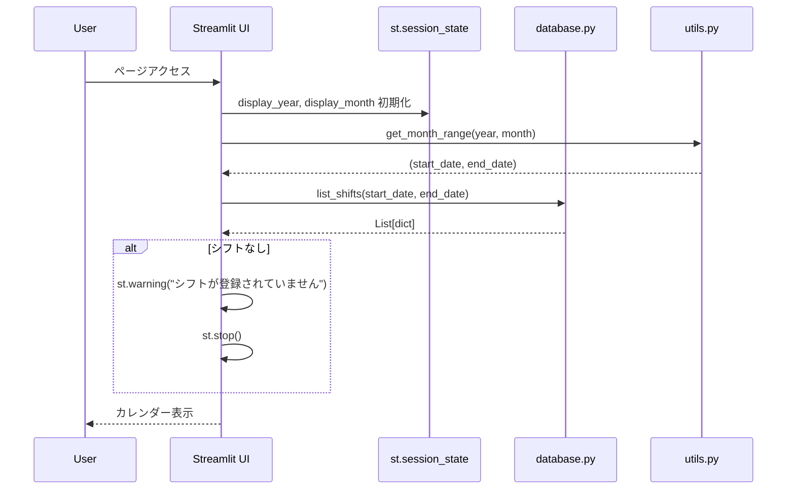
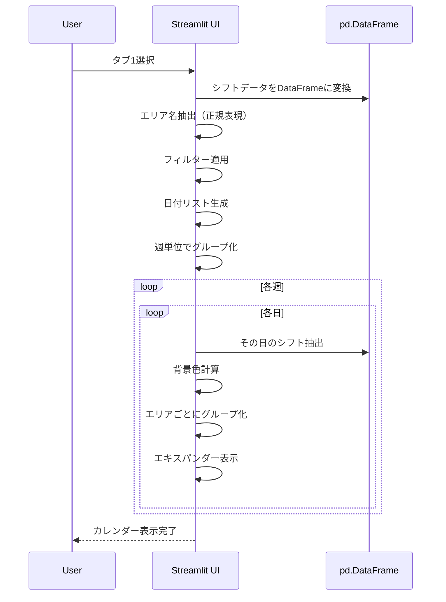
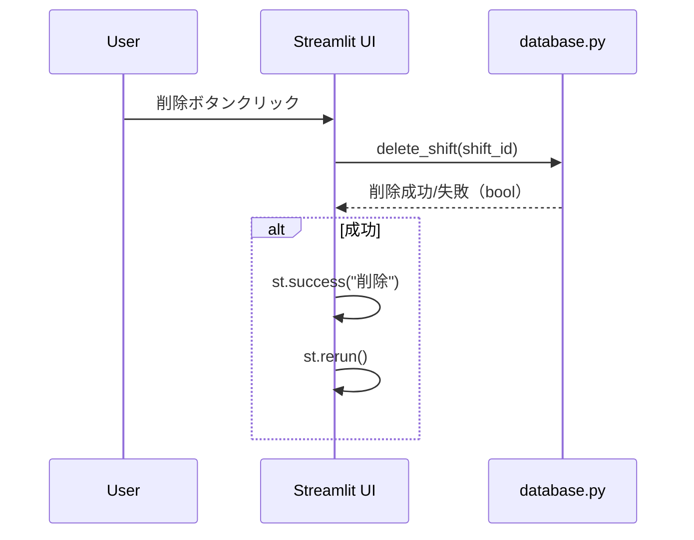
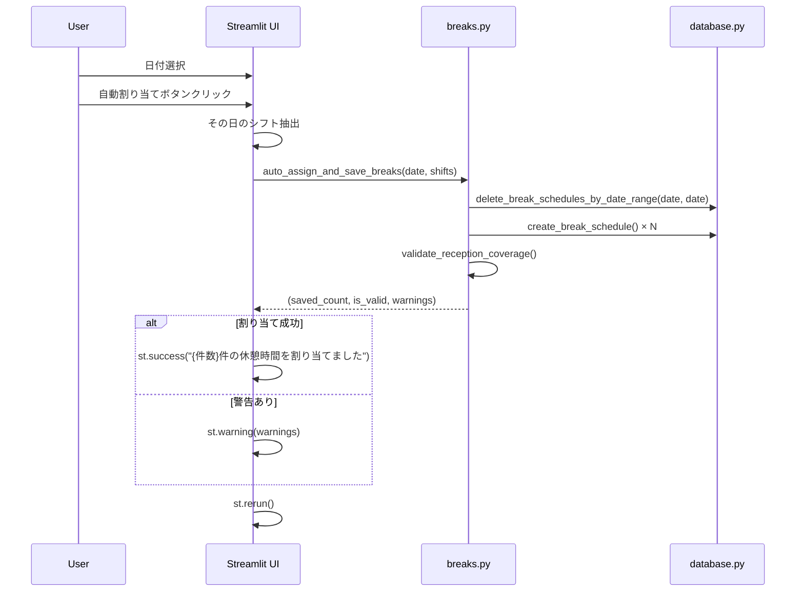
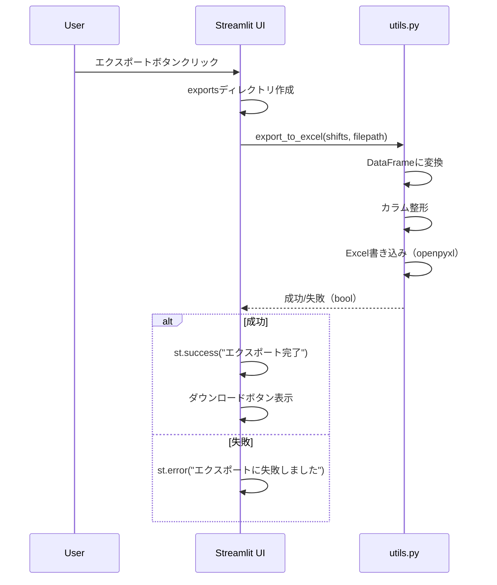

# シフト表示画面 詳細設計書

## 1. 画面概要

### 1.1 目的
生成されたシフトをカレンダー形式で表示し、休憩時間の管理、統計分析、データエクスポートを行う画面。

### 1.2 画面パス
- **ファイルパス**: `pages/4_📋_シフト表示.py`
- **URL**: `/4_📋_シフト表示`（Streamlitのページルーティング）

### 1.3 画面構成
- 年月選択エリア（矢印ボタン + セレクトボックス）
- タブ1: 📅 カレンダー表示
- タブ2: ☕ 休憩時間
- タブ3: 📊 統計・分析
- タブ4: 📥 エクスポート
- サイドバー: ヘルプ情報

### 1.4 設計思想
- **視覚的なシフト確認**: カレンダー形式での直感的な表示
- **休憩時間管理**: 受付窓口カバレッジの検証
- **データ分析**: 職員別・時間帯別の統計情報
- **データ連携**: Excel形式でのエクスポート

---

## 2. データモデル

### 2.1 Shift（表示用シフト）

list_shifts()から返されるシフトデータ（辞書形式）。

#### プロパティ

| 項目名 | 型 | 説明 |
|--------|-----|------|
| id | int | シフトID |
| date | str | 日付（YYYY-MM-DD） |
| time_slot_id | str | 時間帯ID |
| employee_id | int | 職員ID |
| employee_name | str | 職員名 |
| time_slot_name | str | 時間帯表示名 |
| start_time | str | 開始時刻（HH:MM） |
| end_time | str | 終了時刻（HH:MM） |
| skill_score | int | スキルスコア |
| employee | dict | 職員情報（辞書） |
| time_slot | dict | 時間帯情報（辞書） |

### 2.2 BreakSchedule（休憩スケジュール）

#### プロパティ

| 項目名 | 型 | 説明 |
|--------|-----|------|
| id | int | 休憩スケジュールID |
| shift_id | int | シフトID |
| employee_id | int | 職員ID |
| date | str | 日付（YYYY-MM-DD） |
| break_number | int | 休憩番号（1, 2, ...） |
| break_start_time | str | 休憩開始時刻（HH:MM） |
| break_end_time | str | 休憩終了時刻（HH:MM） |

---

## 3. 画面レイアウト

### 3.1 年月選択エリア

#### レイアウト構成

**4カラムレイアウト（比率: 1:3:3:1）**

| カラム | 項目 | タイプ | 機能 |
|--------|------|--------|------|
| 1 | ◀ | button | 前月へ移動 |
| 2 | 年 | selectbox | 年選択（現在年-1〜現在年+2） |
| 3 | 月 | selectbox | 月選択（1〜12） |
| 4 | ▶ | button | 次月へ移動 |

**セッション状態**:
- `display_year`: 選択中の年
- `display_month`: 選択中の月

### 3.2 タブ1: カレンダー表示

#### 3.2.1 フィルター・コントロールエリア

**3カラムレイアウト（比率: 2:2:1）**

| カラム | 項目 | タイプ | 機能 |
|--------|------|--------|------|
| 1 | 業務エリアで絞り込み | multiselect | リハ室、受付などで絞り込み |
| 2 | すべて開く / すべて閉じる | button × 2 | エキスパンダーの一括開閉 |
| 3 | リセット | button | フィルターとエキスパンダー状態をリセット |

**セッション状態**:
- `expander_state`: エキスパンダーの開閉状態（bool）

#### 3.2.2 カレンダー表示

**週単位のグリッドレイアウト（7カラム）**

##### ヘッダー行

| 月 | 火 | 水 | 木 | 金 | 土 | 日 |
|----|----|----|----|----|----|----|

##### 日付セルの構成

**HTML構造**:
```html
<!-- 日付ヘッダー -->
<div style="background-color: {bg_color}; padding: 5px; border-radius: 5px 5px 0 0; text-align: center;">
    <div style="font-size: 16px; font-weight: bold; color: {text_color};">{日}</div>
</div>

<!-- シフト情報 -->
<div style="background-color: white; padding: 5px; border: 1px solid #dee2e6; border-radius: 0 0 5px 5px; min-height: 100px;">
    <!-- エリアごとのエキスパンダー -->
    <!-- シフト数・平均スキル -->
</div>
```

**背景色の設定**:

| 条件 | 背景色 | 意味 |
|------|--------|------|
| 日曜日 | #2c2c2c（暗灰色） | 定休日 |
| 平均スキル >= 4.0 | #51cf66（緑） | 高スキル |
| 平均スキル >= 3.0 | #74c0fc（青） | 中スキル |
| 平均スキル < 3.0 | #ffa94d（オレンジ） | 低スキル |
| シフトなし | #868e96（灰色） | 未割り当て |

##### エリアごとのエキスパンダー

**構造**:
```
📞 受付 (エキスパンダー)
  └─ **午前** (08:30 - 13:00)
      ├─ 👤 山田太郎
      │   └─ 💪 150.0
      │   └─ 🗑️ (削除ボタン)
      ├─ 👤 鈴木花子
      │   └─ 💪 145.0
      │   └─ 🗑️ (削除ボタン)
      └─ 合計: 295.0 / 平均: 147.5
```

**エリアアイコン**:
- リハ室: 🏥
- 受付: 📞
- その他: 🏢

##### シフト数・スキルメトリック

| メトリック名 | 計算式 |
|------------|--------|
| シフト数 | その日のシフト件数 |
| 平均スキル | その日のスキルスコア平均 |

### 3.3 タブ2: 休憩時間

#### 3.3.1 日付選択・自動割り当てエリア

**2カラムレイアウト（比率: 2:3）**

| カラム | 項目 | タイプ | 機能 |
|--------|------|--------|------|
| 1 | 日付を選択 | selectbox | シフトが存在する日付から選択 |
| 2 | 休憩時間を自動割り当て | button | 選択日の休憩を自動割り当て |

**日付のフォーマット**: `{YYYY-MM-DD} ({曜日})`

#### 3.3.2 休憩スケジュール表示

**3カラムレイアウト（比率: 2:3:2）**

| カラム | 内容 |
|--------|------|
| 1 | 👤 {職員名} |
| 2 | 休憩{番号}: {開始} - {終了} |
| 3 | メトリック: {時間}分 |

#### 3.3.3 窓口カバレッジチェック

**表示内容**:
- 受付窓口の常駐人数チェック結果
- 成功: "✅ 受付窓口の常駐人数は常に2名以上です"
- 失敗: "❌ 受付窓口の常駐人数が不足する時間帯があります" + 警告リスト

### 3.4 タブ3: 統計・分析

#### 3.4.1 職員別勤務日数

**2カラムレイアウト**

| カラム | 内容 |
|--------|------|
| 1 | 棒グラフ（Plotly） |
| 2 | データテーブル |

**データテーブルカラム**:
- 職員名
- 勤務日数
- スキルスコア（最初の値）

#### 3.4.2 時間帯別スキル分布

**2カラムレイアウト**

| カラム | 内容 |
|--------|------|
| 1 | 折れ線グラフ（日別・時間帯別スキル合計） |
| 2 | データテーブル（時間帯別平均） |

**データテーブルカラム**:
- 時間帯
- スキル合計（平均）
- スキル平均（平均）
- 人数（平均）

#### 3.4.3 全体統計

**4カラムレイアウト**

| カラム | メトリック名 | 計算式 |
|--------|------------|--------|
| 1 | 総シフト数 | len(shifts) |
| 2 | 平均スキル | skill_scoreの平均 |
| 3 | スキル標準偏差 | skill_scoreの標準偏差 |
| 4 | バランススコア | 時間帯ごとのスキル合計の標準偏差 |

**評価メッセージ**:

| 条件 | メッセージ | タイプ |
|------|-----------|--------|
| バランススコア < 10 | 🌟 スキルバランスが非常に良好です！ | success |
| バランススコア < 20 | ✨ スキルバランスは良好です | info |
| バランススコア >= 20 | ⚠️ スキルにやや偏りがあります | warning |

### 3.5 タブ4: エクスポート

#### 2カラムレイアウト

| カラム | 内容 |
|--------|------|
| 1 | Excelエクスポートボタン + ダウンロードボタン |
| 2 | エクスポート形式の説明（infoボックス） |

**エクスポート機能**:
1. ボタンクリック
2. `exports/shift_{年月}.xlsx` にファイル生成
3. 成功メッセージ表示
4. ダウンロードボタン表示

---

## 4. データフロー

### 4.1 画面初期表示フロー



### 4.2 カレンダー表示フロー



### 4.3 シフト削除フロー



### 4.4 休憩自動割り当てフロー



### 4.5 Excelエクスポートフロー



---

## 5. ビジネスロジック

### 5.1 エリア名・時間帯の抽出

```python
# エリア名を抽出（例: "リハ室（月曜午前）" -> "リハ室"）
df['area'] = df['time_slot_name'].str.extract(r'^([^（]+)', expand=False)

# 時間帯を抽出（例: "リハ室（月曜午前）" -> "午前"）
df['period'] = df['time_slot_name'].str.extract(r'(午前|午後)', expand=False)
```

### 5.2 週分割ロジック

```python
weeks = []
current_week = []

for date_obj in display_dates:
    day_of_week = date_obj.weekday()  # 0=月曜, 6=日曜
    
    # 月曜日で週の途中なら新しい週を開始
    if day_of_week == 0 and current_week:
        weeks.append(current_week)
        current_week = []
    
    # 最初の週の場合、月曜日まで空白を追加
    if not current_week and len(weeks) == 0:
        for _ in range(day_of_week):
            current_week.append(None)
    
    current_week.append(date_obj)
    
    # 日曜日で週を完了
    if day_of_week == 6:
        weeks.append(current_week)
        current_week = []

# 最後の週が残っている場合、日曜日まで空白で埋める
if current_week:
    while len(current_week) < 7:
        current_week.append(None)
    weeks.append(current_week)
```

### 5.3 背景色決定ロジック

```python
def get_date_bg_color(day_shifts, is_sunday):
    if is_sunday:
        return "#2c2c2c"  # 暗灰色
    
    if len(day_shifts) == 0:
        return "#868e96"  # 灰色（シフトなし）
    
    avg_skill = day_shifts['skill_score'].mean()
    
    if avg_skill >= 4.0:
        return "#51cf66"  # 緑（高スキル）
    elif avg_skill >= 3.0:
        return "#74c0fc"  # 青（中スキル）
    else:
        return "#ffa94d"  # オレンジ（低スキル）
```

### 5.4 統計計算

#### 職員別勤務日数

```python
employee_counts = df.groupby('employee_name').size().reset_index(name='勤務日数')
employee_skills = df.groupby('employee_name')['skill_score'].first().reset_index()
employee_stats = employee_counts.merge(employee_skills, on='employee_name')
employee_stats = employee_stats.sort_values('勤務日数', ascending=False)
```

#### 時間帯別集計

```python
time_slot_stats = df.groupby(['date', 'time_slot_name', 'time_slot_id']).agg({
    'skill_score': ['sum', 'mean', 'count']
}).reset_index()

time_slot_avg = time_slot_stats.groupby('時間帯').agg({
    'スキル合計': 'mean',
    'スキル平均': 'mean',
    '人数': 'mean'
}).reset_index()
```

#### バランススコア

```python
# 各日付・時間帯のスキル合計を計算
slot_totals = df.groupby(['date', 'time_slot_id'])['skill_score'].sum()

# 標準偏差を計算
balance_score = slot_totals.std()
```

### 5.5 窓口カバレッジ検証

```python
def validate_reception_coverage(date, shifts, break_schedules):
    reception_shifts = [s for s in shifts if s['time_slot']['area'] == "受付"]
    
    if not reception_shifts:
        return True, []
    
    warnings = []
    intervals = generate_time_intervals("08:30", "19:00", 15)  # 15分刻み
    
    for window in intervals:
        working = _count_working_staff(reception_shifts, break_schedules, window)
        if working < 2:
            warnings.append(f"{window[0]}-{window[1]}の受付常駐人数が不足しています ({working}名)")
    
    return (len(warnings) == 0), warnings
```

---

## 6. UI/UXの詳細

### 6.1 カラーパレット

| 用途 | カラーコード | 色名 | 意味 |
|------|------------|------|------|
| 高スキル | #51cf66 | 緑 | 平均スキル >= 4.0 |
| 中スキル | #74c0fc | 青 | 平均スキル >= 3.0 |
| 低スキル | #ffa94d | オレンジ | 平均スキル < 3.0 |
| シフトなし | #868e96 | 灰色 | シフト未割り当て |
| 定休日 | #2c2c2c | 暗灰色 | 日曜日 |

### 6.2 アイコンの使用

| アイコン | 意味 | 使用場面 |
|---------|------|---------|
| 🏥 | リハ室 | エリア名表示 |
| 📞 | 受付 | エリア名表示 |
| 🏢 | その他 | エリア名表示 |
| 👤 | 職員 | 職員名の前 |
| 💪 | スキル | スキルスコア表示 |
| 🗑️ | 削除 | 削除ボタン |
| 🌙 | 定休 | 日曜日 |
| 📭 | シフトなし | シフト未割り当て日 |
| ☕ | 休憩 | 休憩タブ |

### 6.3 メッセージ表示

#### 6.3.1 成功メッセージ

| タイプ | メッセージ |
|--------|-----------|
| シフト表示 | "✅ {件数}件のシフトが登録されています" |
| 休憩割り当て | "✅ {件数}件の休憩時間を割り当てました" |
| カバレッジOK | "✅ 受付窓口の常駐人数は常に2名以上です" |
| エクスポート | "✅ エクスポート完了: exports/{filename}" |
| シフト削除 | "削除" |

#### 6.3.2 警告メッセージ

| タイプ | メッセージ |
|--------|-----------|
| シフトなし | "⚠️ シフトが登録されていません" |
| カバレッジNG | "❌ 受付窓口の常駐人数が不足する時間帯があります" |
| バランス悪 | "⚠️ スキルにやや偏りがあります" |

#### 6.3.3 情報メッセージ

| タイプ | メッセージ |
|--------|-----------|
| シフト作成案内 | "🎯 「シフト生成」ページでシフトを作成してください" |
| 休憩未設定 | "この日の休憩スケジュールはまだ設定されていません" |
| 休憩ルール | "フルタイム職員: 1時間 × 2回..." |

### 6.4 インタラクション

#### 6.4.1 エキスパンダーの一括開閉

- 「すべて開く」ボタン → `st.session_state.expander_state = True`
- 「すべて閉じる」ボタン → `st.session_state.expander_state = False`
- 各エキスパンダーは `expanded=st.session_state.expander_state` で制御

#### 6.4.2 シフト削除の即時反映

1. 削除ボタンクリック
2. `delete_shift(shift_id)` 実行
3. 成功時: `st.success()` → `st.rerun()`

#### 6.4.3 休憩割り当ての流れ

1. 日付選択
2. 自動割り当てボタンクリック
3. スピナーなし（即座に実行）
4. 成功メッセージ表示
5. `st.rerun()` でリロード

---

## 7. データベース操作

### 7.1 使用する関数

| 関数名 | モジュール | 用途 | 引数 | 戻り値 |
|--------|----------|------|------|--------|
| list_shifts | database.py | シフト一覧取得 | start_date: str, end_date: str | List[dict] |
| delete_shift | database.py | シフト削除 | shift_id: int | bool |
| get_break_schedules | breaks.py | 休憩スケジュール取得 | date: str | List[dict] |
| get_employee | database.py | 職員取得 | employee_id: int | Optional[Employee] |
| auto_assign_and_save_breaks | breaks.py | 休憩自動割り当て | date: str, shifts: List[dict] | Tuple[int, bool, List[str]] |
| validate_reception_coverage | breaks.py | カバレッジ検証 | date: str, shifts: List[dict], breaks: List[dict] | Tuple[bool, List[str]] |
| get_month_range | utils.py | 月次期間取得 | year: int, month: int | Tuple[str, str] |
| get_weekday_jp | utils.py | 曜日取得 | date: str | str |
| export_to_excel | utils.py | Excel出力 | shifts: List[dict], filepath: str | bool |

### 7.2 トランザクション

#### シフト削除
```python
delete_shift(shift_id)
# 単一DELETE文、自動コミット
# CASCADE により関連する休憩スケジュールも削除
```

#### 休憩割り当て
```python
# breaks.py内で以下を実行:
# 1. DELETE（該当日の既存休憩）
# 2. INSERT（新規休憩）× N件
# 各操作は独立したトランザクション
```

### 7.3 データ整合性

#### 外部キー制約
```sql
-- break_schedules テーブル
FOREIGN KEY (shift_id) REFERENCES shifts(id) ON DELETE CASCADE
```

**影響**: シフト削除時に関連する休憩スケジュールも自動削除

---

## 8. エラーハンドリング

### 8.1 シフト未登録時の処理

```python
shifts = list_shifts(start_date, end_date)
if not shifts:
    st.warning("⚠️ シフトが登録されていません")
    st.info("🎯 「シフト生成」ページでシフトを作成してください")
    st.stop()
```

**動作**: 画面の描画を停止し、警告メッセージのみ表示

### 8.2 削除失敗

シフト削除時に`delete_shift()`がFalseを返した場合は何も表示しない（サイレント）。

### 8.3 エクスポート失敗

```python
if export_to_excel(shifts, filepath):
    st.success("エクスポート完了")
else:
    st.error("エクスポートに失敗しました")
```

---

## 9. パフォーマンス

### 9.1 データ処理の最適化

- **Pandasの活用**: シフトデータをDataFrameに変換して高速処理
- **グループ化**: `groupby()`で効率的な集計
- **フィルタリング**: DataFrameのフィルター機能で高速抽出

### 9.2 レンダリングの最適化

- カレンダーは最大5週分（35セル）程度
- エキスパンダーの開閉状態をセッション管理で制御
- グラフはPlotlyで描画（インタラクティブ）

### 9.3 ページリロードの最小化

- 削除後のみ`st.rerun()`を実行
- フィルター変更は自動リロード（Streamlitの標準動作）

---

## 10. セキュリティ

### 10.1 入力バリデーション

- 日付選択: データベースから取得した日付のみ選択可能
- シフトID: ボタンのkeyに埋め込まれたIDのみ削除可能

### 10.2 SQLインジェクション対策

- パラメータ化クエリを使用（database.py内で実装）
- ユーザー入力を直接SQL文に含めない

---

## 11. テスト観点

### 11.1 機能テスト

| テストケース | 操作 | 期待結果 |
|------------|------|---------|
| カレンダー表示 | シフトあり | 日付セルにシフト情報表示 |
| カレンダー表示（日曜） | 日曜日を含む | 定休表示 |
| カレンダー表示（シフトなし） | シフトなし | 警告メッセージ表示 |
| エリアフィルター | リハ室のみ選択 | リハ室のシフトのみ表示 |
| エキスパンダー開閉 | すべて開くクリック | 全エキスパンダーが開く |
| シフト削除 | 削除ボタンクリック | シフトが削除され、リロード |
| 休憩自動割り当て | ボタンクリック | 休憩スケジュールが作成 |
| カバレッジ検証 | 休憩割り当て後 | カバレッジチェック結果表示 |
| Excelエクスポート | ボタンクリック | Excelファイル生成 |

### 11.2 UIテスト

| テストケース | 操作 | 期待結果 |
|------------|------|---------|
| 年月移動 | 矢印ボタンクリック | 前月/次月に移動 |
| タブ切替 | タブクリック | タブ内容が切り替わる |
| グラフ表示 | 統計タブ選択 | Plotlyグラフ表示 |
| ダウンロード | エクスポート後 | ダウンロードボタン表示 |

### 11.3 データ整合性テスト

| テストケース | 操作 | 期待結果 |
|------------|------|---------|
| シフト削除時の休憩削除 | シフト削除 | 関連する休憩も自動削除 |
| 統計計算の正確性 | - | 手計算と一致 |
| バランススコア計算 | - | 標準偏差が正しく計算 |

### 11.4 パフォーマンステスト

| テストケース | 条件 | 期待結果 |
|------------|------|---------|
| 大量データ表示 | 1000件のシフト | 3秒以内に表示 |
| グラフ描画 | 30日分のデータ | 1秒以内に描画 |
| Excelエクスポート | 1000件のシフト | 5秒以内に完了 |

---

## 12. 今後の拡張予定

### 12.1 機能追加候補

- [ ] シフトの個別編集機能（職員変更、時間変更）
- [ ] シフトのドラッグ&ドロップ移動
- [ ] 複数シフトの一括削除
- [ ] 日付範囲でのシフト一括操作
- [ ] シフトのコピー&ペースト
- [ ] シフトの印刷プレビュー
- [ ] PDFエクスポート
- [ ] CSVエクスポート
- [ ] 休憩時間の手動編集

### 12.2 統計・分析機能の拡張

- [ ] 月次レポート自動生成
- [ ] 職員の疲労度分析（連続勤務日数等）
- [ ] スキルバランスのトレンド分析
- [ ] 時間帯別の充足率グラフ
- [ ] 比較分析（前月比、前年比）
- [ ] カスタムレポート機能

### 12.3 UI/UX改善候補

- [ ] カレンダービューとリストビューの切り替え
- [ ] シフト情報のツールチップ表示
- [ ] 色のカスタマイズ機能
- [ ] フィルターの保存機能
- [ ] ショートカットキー対応
- [ ] レスポンシブデザイン改善

---

## 13. 制約事項

### 13.1 現在の制限

1. **編集機能**: シフトの編集は削除のみ（変更は再生成が必要）
2. **一括操作**: 複数シフトの同時削除はできない
3. **履歴管理**: 削除したシフトの復元不可
4. **印刷機能**: ブラウザの印刷機能に依存

### 13.2 データ表示の前提

1. **20日締め固定**: 表示期間は20日締めで固定
2. **Excelフォーマット**: エクスポート形式は固定（カスタマイズ不可）
3. **グラフの制限**: Plotlyの標準機能のみ使用

---

## 14. グラフ・チャートの詳細

### 14.1 職員別勤務日数（棒グラフ）

**Plotly設定**:
```python
fig = px.bar(
    employee_stats,
    x='employee_name',
    y='勤務日数',
    title='職員別勤務日数',
    labels={'employee_name': '職員名', '勤務日数': '日数'}
)
```

**表示内容**:
- X軸: 職員名
- Y軸: 勤務日数
- ソート: 勤務日数降順

### 14.2 日別・時間帯別スキル合計（折れ線グラフ）

**Plotly設定**:
```python
fig2 = px.line(
    time_slot_stats,
    x='日付',
    y='スキル合計',
    color='時間帯',
    title='日別・時間帯別スキル合計',
    markers=True
)
```

**表示内容**:
- X軸: 日付
- Y軸: スキル合計
- 線の色: 時間帯別
- マーカー: 各日付にドット表示

---

## 15. Excelエクスポートの詳細

### 15.1 出力ファイル形式

**ファイル名**: `shift_{年}{月}.xlsx`  
**例**: `shift_202512.xlsx`

**保存先**: `exports/` ディレクトリ

### 15.2 出力カラム

| カラム名 | データ | 説明 |
|---------|--------|------|
| 日付 | date | YYYY-MM-DD形式 |
| 時間帯 | time_slot_name | 時間帯表示名 |
| 開始時刻 | start_time | HH:MM形式 |
| 終了時刻 | end_time | HH:MM形式 |
| 職員名 | employee_name | 職員名 |
| スキル | skill_score | スキルスコア |

### 15.3 実装

```python
def export_to_excel(shifts, filepath):
    try:
        df = pd.DataFrame(shifts)
        columns = ["date", "time_slot_name", "start_time", "end_time", "employee_name", "skill_score"]
        df = df[columns]
        df.columns = ["日付", "時間帯", "開始時刻", "終了時刻", "職員名", "スキル"]
        df.to_excel(filepath, index=False, engine="openpyxl")
        return True
    except Exception:
        return False
```

---

## 16. 関連ドキュメント

- [要求事項定義書](../docs/REQUIREMENTS.md) - 6. シフト表示・編集
- [アーキテクチャ設計書](../docs/ARCHITECTURE.md) - データモデル
- [breaks.py 実装](../src/shift_scheduler/breaks.py)
- [utils.py 実装](../src/shift_scheduler/utils.py)

---

**作成日**: 2025年12月8日  
**バージョン**: 1.0  
**作成者**: システム開発チーム
