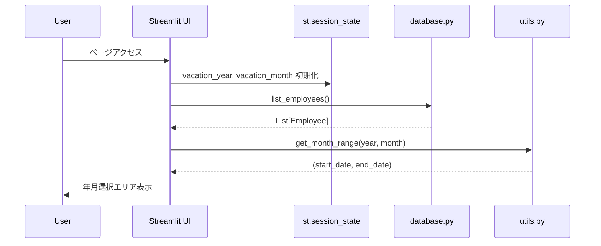
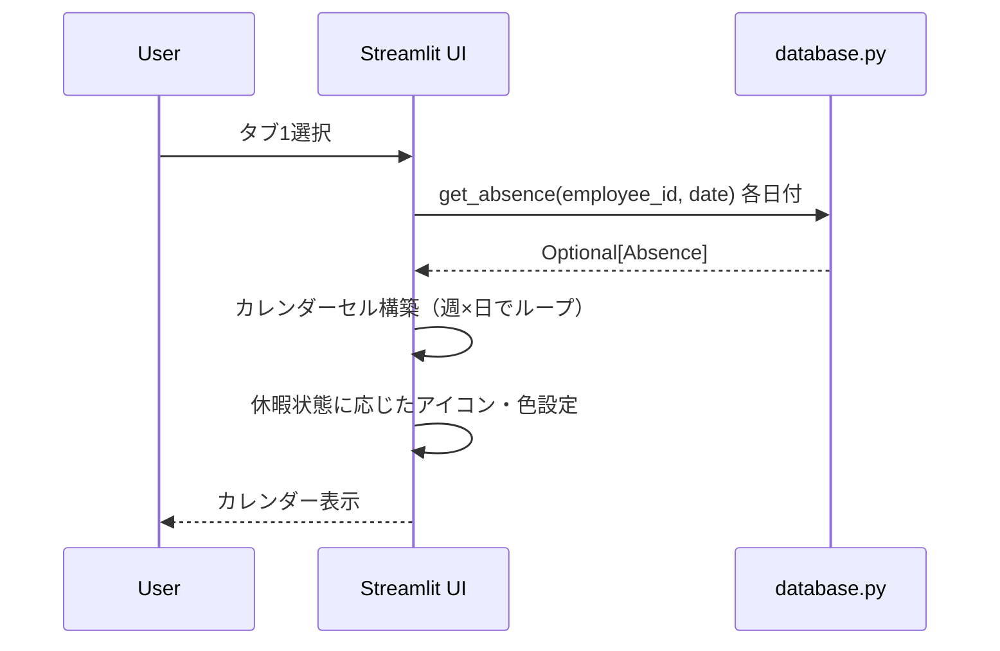
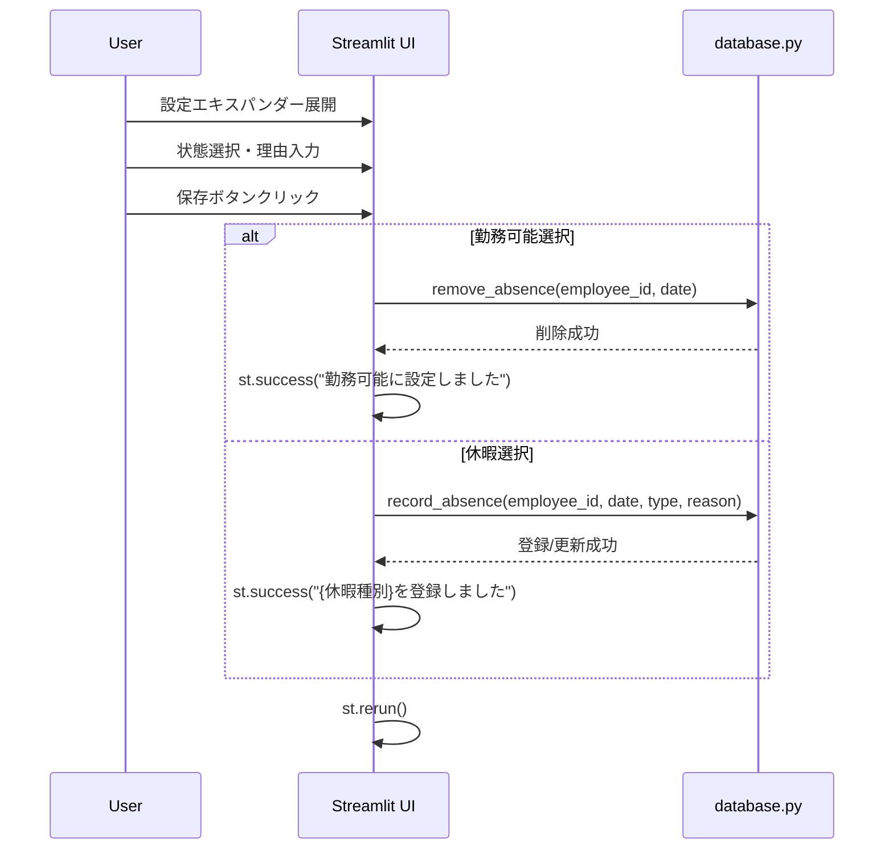
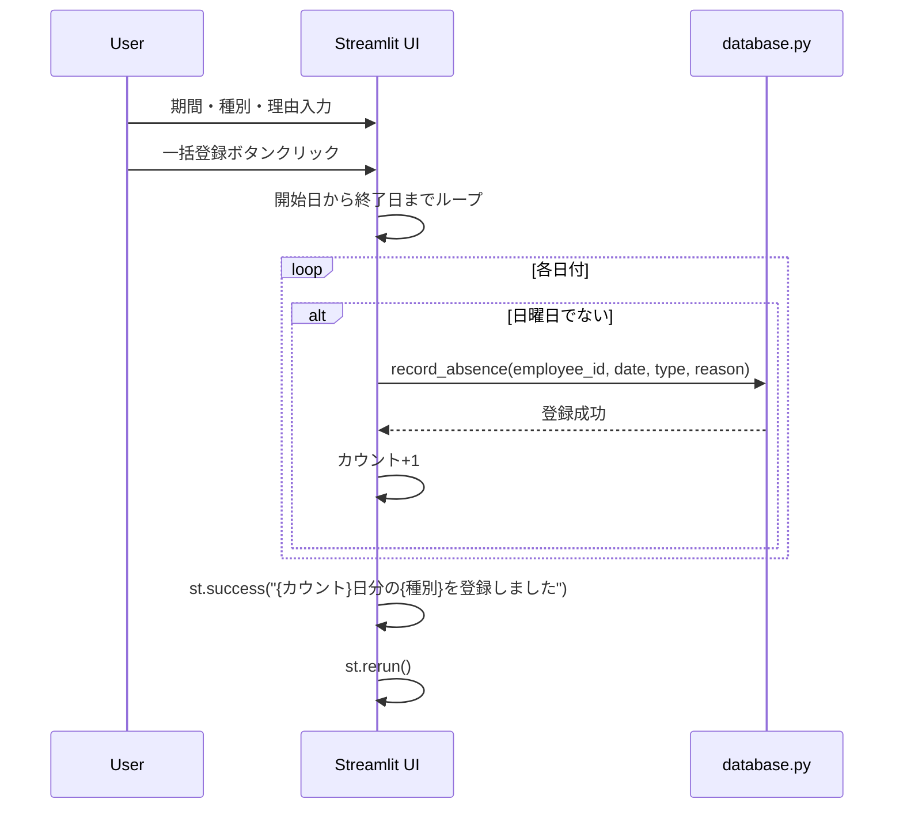
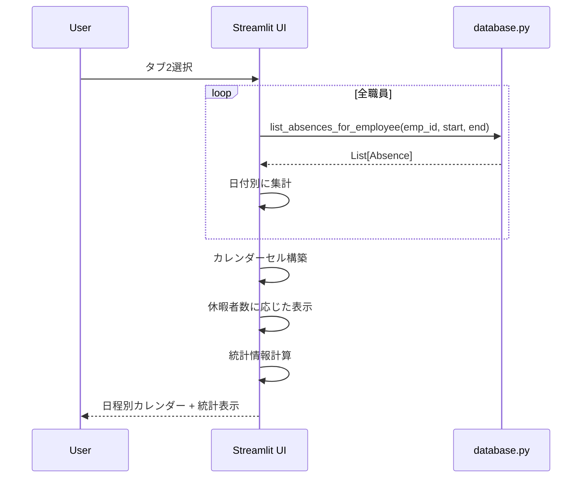

# 休暇管理画面 詳細設計書

## 1. 画面概要

### 1.1 目的
職員の休暇情報を日付単位で登録・編集・削除し、カレンダー形式で可視化する画面。

### 1.2 画面パス
- **ファイルパス**: `pages/2_🏖️_休暇管理.py`
- **URL**: `/2_🏖️_休暇管理`（Streamlitのページルーティング）

### 1.3 画面構成
- 年月選択エリア（矢印ボタン + セレクトボックス）
- タブ1: 👤 職員別表示
- タブ2: 📅 日程別表示

### 1.4 設計思想
- **デフォルト動作**: 休暇登録のない日は、職員の勤務形態に応じて自動的に勤務可能と判定
- **休暇登録**: 休暇を取る日のみ登録（日付と休暇種別）
- **勤務可否判定**: システムが勤務形態と休暇登録から自動判定
- **20日締め対応**: 月次期間は前月20日〜当月20日で表示
- **カレンダービュー**: 視覚的に休暇状況を把握しやすいUI

---

## 2. データモデル

### 2.1 Absence（休暇）エンティティ

#### プロパティ

| 項目名 | 型 | 必須 | デフォルト | 制約 | 説明 |
|--------|-----|------|-----------|------|------|
| id | int | ○ | AUTO | PRIMARY KEY | 休暇ID（自動採番） |
| employee_id | int | ○ | - | FK | 職員ID |
| absence_date | str | ○ | - | DATE | 休暇日付（YYYY-MM-DD） |
| absence_type | str | ○ | - | CHECK | 休暇種別（full_day/morning/afternoon） |
| reason | str | - | None | - | 休暇理由 |
| created_at | datetime | ○ | CURRENT_TIMESTAMP | - | 作成日時 |
| updated_at | datetime | ○ | CURRENT_TIMESTAMP | - | 更新日時 |

#### 休暇種別

| 内部値 | 日本語表示 | アイコン | 背景色 | 説明 | 影響範囲 |
|--------|-----------|---------|--------|------|----------|
| full_day | 終日休暇 | 🏖️ | #ff6b6b（赤） | 1日全体の休暇 | その日の全時間帯が勤務不可 |
| morning | 午前休 | 🌅 | #ffa94d（オレンジ） | 午前のみの休暇 | 午前の時間帯のみ勤務不可 |
| afternoon | 午後休 | 🌆 | #74c0fc（青） | 午後のみの休暇 | 午後の時間帯のみ勤務不可 |

#### 運用ルール

- **デフォルト**: 休暇登録のない日は、職員の勤務形態に応じて自動的に勤務可能と判定
- **休暇登録**: 休暇を取る日付と休暇種別のみを登録
- **時間帯の可否**: システムが勤務形態と休暇登録から自動判定

#### ユニーク制約

```sql
UNIQUE(employee_id, absence_date, absence_type)
```

同一職員の同一日に同じ種別の休暇は重複登録不可。

---

## 3. 画面レイアウト

### 3.1 年月選択エリア

#### 3.1.1 レイアウト構成

**4カラムレイアウト（比率: 1:3:3:1）**

| カラム | 項目 | タイプ | 機能 |
|--------|------|--------|------|
| 1 | ◀ | button | 前月へ移動 |
| 2 | 年 | selectbox | 年選択（現在年-1〜現在年+2） |
| 3 | 月 | selectbox | 月選択（1〜12） |
| 4 | ▶ | button | 次月へ移動 |

#### 3.1.2 セッション状態管理

| キー | 型 | 初期値 | 説明 |
|------|-----|--------|------|
| vacation_year | int | 現在年 | 選択中の年 |
| vacation_month | int | 現在月 | 選択中の月 |

#### 3.1.3 矢印ボタンの動作

**前月ボタン（◀）**:
```python
if month == 1:
    month = 12
    year -= 1
else:
    month -= 1
```

**次月ボタン（▶）**:
```python
if month == 12:
    month = 1
    year += 1
else:
    month += 1
```

#### 3.1.4 期間計算

20日締めの期間を`get_month_range(year, month)`で計算:
- **開始日**: 前月20日
- **終了日**: 当月20日

### 3.2 タブ1: 職員別表示

#### 3.2.1 職員選択エリア

**セレクトボックス**:
- **表示形式**: `{職員名} ({勤務パターンID})`
- **セッション状態**: `selected_employee_idx`（選択インデックス）

#### 3.2.2 カレンダー表示

**週単位のグリッドレイアウト（7カラム）**

##### ヘッダー行

| 月 | 火 | 水 | 木 | 金 | 土 | 日 |
|----|----|----|----|----|----|----|

##### 日付セルの構成

**HTML構造**:
```html
<div style="background-color: {bg_color}; padding: 10px; border-radius: 5px; text-align: center; margin-bottom: 5px;">
    <div style="font-size: 20px; font-weight: bold; color: white;">{日}</div>
    <div style="font-size: 24px;">{アイコン}</div>
    <div style="font-size: 12px; color: white;">{状態テキスト}</div>
</div>
```

**セルの表示パターン**:

| 条件 | アイコン | 状態テキスト | 背景色 |
|------|---------|------------|--------|
| 日曜日 | 🌙 | 定休 | #2c2c2c（暗灰色） |
| 終日休暇 | 🏖️ | 終日休暇 | #ff6b6b（赤） |
| 午前休 | 🌅 | 午前休 | #ffa94d（オレンジ） |
| 午後休 | 🌆 | 午後休 | #74c0fc（青） |
| 勤務可能 | ✅ | 勤務可能 | #51cf66（緑） |

##### 設定エキスパンダー（日曜日以外）

**配置項目**:

| 項目 | タイプ | 選択肢 | 初期値 |
|------|--------|--------|--------|
| 状態 | radio | 勤務可能、終日休暇、午前休、午後休 | 現在の休暇種別 |
| 理由 | text_input | - | 現在の理由 |
| 保存 | button | - | - |

**保存ボタンの動作**:
- 「勤務可能」選択時: `remove_absence()` で休暇削除
- その他選択時: `record_absence()` で休暇登録/更新
- 保存後: `st.rerun()` でページリロード

#### 3.2.3 一括操作エリア

**2カラムレイアウト**

##### 左カラム: 期間指定で休暇登録

| 項目 | タイプ | デフォルト値 |
|------|--------|------------|
| 開始日 | date_input | 期間開始日（前月20日） |
| 終了日 | date_input | 期間終了日（当月19日） |
| 休暇種別 | selectbox | 終日休暇、午前休、午後休 |
| 理由 | text_input | "" |
| 一括登録 | button | - |

**一括登録の処理**:
1. 開始日から終了日まで1日ずつループ
2. 日曜日はスキップ
3. `record_absence()` で休暇登録
4. 登録件数をカウントして成功メッセージ表示
5. `st.rerun()` でリロード

##### 右カラム: 休暇一覧（当月）

**表示内容**:
- 当月（20日締め期間）の休暇リストを表示
- 各行: `{月/日} {休暇種別} - {理由}` + 削除ボタン

**削除ボタンの動作**:
- `remove_absence(employee_id, absence_date, absence_type)` で削除
- `st.rerun()` でリロード

### 3.3 タブ2: 日程別表示

#### 3.3.1 カレンダー表示

**週単位のグリッドレイアウト（7カラム）**

##### 日付セルの構成

**HTML構造**:
```html
<div style="background-color: {bg_color}; padding: 10px; border-radius: 5px; text-align: center; margin-bottom: 5px; min-height: 100px;">
    <div style="font-size: 20px; font-weight: bold; color: white;">{日}</div>
    <div style="font-size: 24px;">{アイコン}</div>
    <div style="font-size: 11px; color: white; margin-top: 5px;">{状態テキスト}</div>
</div>
```

**セルの表示パターン**:

| 条件 | アイコン | 状態テキスト | 背景色 |
|------|---------|------------|--------|
| 日曜日 | 🌙 | 定休 | #2c2c2c（暗灰色） |
| 休暇者あり | 🏖️ | 休暇: {人数}名 | #ff6b6b（赤） |
| 全員出勤 | ✅ | 全員出勤 | #51cf66（緑） |

##### 詳細エキスパンダー（休暇者がいる日のみ）

**表示内容**:
- 各休暇者の情報を表示
- 形式: `{職員名}: {種別アイコン+ラベル} - {理由}`

**種別アイコンとラベル**:

| 種別 | アイコン+ラベル |
|------|---------------|
| full_day | 🏖️ 終日 |
| morning | 🌅 午前 |
| afternoon | 🌆 午後 |

#### 3.3.2 休暇統計エリア

**3カラムレイアウト**

| カラム | メトリック名 | 計算式 |
|--------|------------|--------|
| 1 | 総休暇件数 | 全休暇データのカウント |
| 2 | 終日休暇 | absence_type == 'full_day'のカウント |
| 3 | 半休（午前/午後） | 総件数 - 終日休暇件数 |

---

## 4. データフロー

### 4.1 画面初期表示フロー



### 4.2 職員別カレンダー表示フロー



### 4.3 休暇登録フロー



### 4.4 一括登録フロー



### 4.5 日程別表示フロー



---

## 5. ビジネスロジック

### 5.1 20日締め期間計算

`get_month_range(year, month, closing_day=20)` を使用:

```python
start = datetime(year, month, 20)  # 前月20日

if month == 12:
    next_month_year = year + 1
    next_month = 1
else:
    next_month_year = year
    next_month = month + 1

end = datetime(next_month_year, next_month, 20)  # 当月20日

return (start.strftime("%Y-%m-%d"), end.strftime("%Y-%m-%d"))
```

### 5.2 カレンダー週分割ロジック

```python
weeks = []
current_week = []

for date_obj in display_dates:
    day_of_week = date_obj.weekday()  # 0=月曜, 6=日曜
    
    # 月曜日で週の途中なら新しい週を開始
    if day_of_week == 0 and current_week:
        weeks.append(current_week)
        current_week = []
    
    # 最初の週の場合、月曜日まで空白を追加
    if not current_week and len(weeks) == 0:
        for _ in range(day_of_week):
            current_week.append(None)
    
    current_week.append(date_obj)
    
    # 日曜日で週を完了
    if day_of_week == 6:
        weeks.append(current_week)
        current_week = []

# 最後の週が残っている場合、日曜日まで空白で埋める
if current_week:
    while len(current_week) < 7:
        current_week.append(None)
    weeks.append(current_week)
```

### 5.3 休暇状態判定ロジック

```python
def get_absence_display(absence_obj, is_sunday):
    if is_sunday:
        return ("🌙", "定休", "#2c2c2c")
    
    if absence_obj is None:
        return ("✅", "勤務可能", "#51cf66")
    
    absence = absence_obj.to_dict()
    type_map = {
        'full_day': ("🏖️", "終日休暇", "#ff6b6b"),
        'morning': ("🌅", "午前休", "#ffa94d"),
        'afternoon': ("🌆", "午後休", "#74c0fc")
    }
    
    return type_map.get(absence['absence_type'], ("❓", "不明", "#gray"))
```

### 5.4 一括登録の日曜日スキップ

```python
count = 0
current = bulk_start

while current <= bulk_end:
    if current.weekday() != 6:  # 日曜日（6）をスキップ
        record_absence(employee_id, current.strftime("%Y-%m-%d"), type, reason)
        count += 1
    current += timedelta(days=1)
```

### 5.5 勤務可否判定ロジック

要求事項定義書「4.2 勤務可否判定ロジック」に準拠:

```python
判定順序:
1. 曜日チェック（日曜日や休診日は全員不可）
2. 休暇登録チェック（employee_absencesテーブル）
3. 勤務形態チェック（employment_patternsの時間範囲）
```

**休暇管理画面の役割**:
- 休暇登録（employee_absencesテーブルへのデータ追加）
- 休暇登録のない日は、シフト生成時に勤務形態で自動判定される

### 5.6 日程別集計ロジック

```python
absences_by_date = {}

for emp in employees:
    emp_absences = list_absences_for_employee(emp['id'], start_date, end_date)
    
    for absence in emp_absences:
        abs_dict = absence.to_dict()
        date_key = abs_dict['absence_date']
        
        if date_key not in absences_by_date:
            absences_by_date[date_key] = []
        
        absences_by_date[date_key].append({
            'employee_name': emp['name'],
            'absence_type': abs_dict['absence_type'],
            'reason': abs_dict.get('reason', '')
        })
```

---

## 6. UI/UXの詳細

### 6.1 カラーパレット

| 用途 | カラーコード | 色名 | 適用対象 |
|------|------------|------|---------|
| 終日休暇 | #ff6b6b | 赤 | full_day |
| 午前休 | #ffa94d | オレンジ | morning |
| 午後休 | #74c0fc | 青 | afternoon |
| 勤務可能 | #51cf66 | 緑 | 休暇なし |
| 定休日 | #2c2c2c | 暗灰色 | 日曜日 |

### 6.2 アイコンの意味

| アイコン | 意味 | 使用場面 |
|---------|------|---------|
| 🏖️ | 終日休暇 | full_day、日程別の休暇あり |
| 🌅 | 午前休 | morning |
| 🌆 | 午後休 | afternoon |
| ✅ | 勤務可能 | 休暇登録なし |
| 🌙 | 定休日 | 日曜日 |

### 6.3 メッセージ表示

| タイプ | 使用場面 | メッセージ例 |
|--------|---------|------------|
| info | 初期表示 | "💡 **デフォルト動作**: 休暇登録のない日は、職員の勤務形態に応じて自動的に勤務可能と判定されます。休暇を取る日のみ登録してください。" |
| info | 期間表示 | "📅 対象期間: 2025-11-20 〜 2025-12-20" |
| info | 休暇なし | "この月の休暇登録はありません" |
| success | 休暇登録 | "✅ 終日休暇を登録しました" |
| success | 勤務可能設定 | "✅ 勤務可能に設定しました" |
| success | 一括登録 | "✅ 5日分の終日休暇を登録しました" |
| warning | 職員なし | "⚠️ 職員が登録されていません" |

### 6.4 インタラクション

#### 6.4.1 年月移動

**矢印ボタン**:
- クリック時: セッション状態を更新してページリロード
- 年をまたぐ場合も自動的に調整

**セレクトボックス**:
- `on_change` コールバックでセッション状態を更新
- ページリロードは不要（Streamlitが自動処理）

#### 6.4.2 休暇設定の即時反映

- 保存ボタンクリック → DB更新 → `st.rerun()`
- 削除ボタンクリック → DB削除 → `st.rerun()`

#### 6.4.3 エキスパンダーの状態

- デフォルト: `expanded=False`（閉じた状態）
- ユーザーがクリックして展開

---

## 7. データベース操作

### 7.1 使用する関数

| 関数名 | モジュール | 用途 | 引数 | 戻り値 |
|--------|----------|------|------|--------|
| list_employees | database.py | 職員一覧取得 | active_only: bool = True | List[Employee] |
| get_absence | database.py | 休暇取得（1件） | employee_id: int, date: str | Optional[Absence] |
| list_absences_for_employee | database.py | 職員の休暇一覧 | employee_id: int, start_date: str, end_date: str | List[Absence] |
| record_absence | database.py | 休暇登録/更新 | employee_id: int, date: str, absence_type: str, reason: Optional[str] | None |
| remove_absence | database.py | 休暇削除 | employee_id: int, date: str, absence_type: Optional[str] | None |
| get_month_range | utils.py | 月次期間取得 | year: int, month: int, closing_day: int = 20 | Tuple[str, str] |

### 7.2 トランザクション

#### 単一登録
- **record_absence**: UPSERT（INSERT ... ON CONFLICT DO UPDATE）
  - 同一キーが存在する場合は更新
  - 自動コミット

#### 一括登録
- ループ内で複数回 `record_absence()` を呼び出し
- 各呼び出しは独立したトランザクション
- 1件失敗しても他の件には影響なし

#### 削除
- **remove_absence**: DELETE
  - absence_typeを指定しない場合は該当日の全休暇を削除
  - 自動コミット

### 7.3 データ整合性

#### ユニーク制約
```sql
UNIQUE(employee_id, absence_date, absence_type)
```

**影響**:
- 同一職員の同一日に同じ種別の休暇を重複登録しようとするとUPDATE動作
- 異なる種別（例: morningとafternoon）は共存可能

#### 外部キー制約
```sql
FOREIGN KEY (employee_id) REFERENCES employees(id)
```

**影響**:
- 職員削除時に関連する休暇も自動削除（CASCADE）

---

## 8. エラーハンドリング

### 8.1 職員未登録時の処理

```python
employees = list_employees()
if not employees:
    st.warning("⚠️ 職員が登録されていません")
    st.stop()
```

**動作**: 画面の描画を停止し、警告メッセージのみ表示

### 8.2 データベースエラー

| エラー種別 | 発生場面 | ハンドリング |
|-----------|---------|-------------|
| 登録失敗 | record_absence() | 例外は発生しない（UPSERT） |
| 削除失敗 | remove_absence() | 例外は発生しない（存在しなくてもOK） |
| 取得失敗 | get_absence() | Noneを返す |

**設計方針**: データベース操作は失敗しにくい設計のため、明示的なエラーハンドリングは最小限

### 8.3 日付の妥当性

- Streamlitの`date_input`が日付の妥当性を保証
- アプリケーション層での追加バリデーション不要

---

## 9. パフォーマンス

### 9.1 データ取得の最適化

#### 職員別表示
- 各日付ごとに`get_absence()`を呼び出し（O(n)、nは日数）
- SQLiteのインデックス（employee_id, absence_date）で高速化

#### 日程別表示
- 全職員分の休暇を一括取得（各職員1回のクエリ）
- メモリ上で日付別に集計

### 9.2 レンダリングの最適化

- カレンダーは最大5週分（35セル）程度
- HTML文字列の直接レンダリング（`unsafe_allow_html=True`）で高速化

### 9.3 ページリロードの最小化

- 保存/削除後のみ`st.rerun()`を実行
- セレクトボックスの変更は自動リロード（Streamlitの標準動作）

---

## 10. セキュリティ

### 10.1 入力サニタイゼーション

- 理由（text_input）: そのままDBに保存（SQLインジェクション対策はパラメータ化クエリで実施）
- 日付（date_input）: Streamlitが妥当性を保証

### 10.2 SQLインジェクション対策

database.py内でパラメータ化クエリを使用:

```python
cur.execute(
    "INSERT INTO employee_absences (...) VALUES (?, ?, ?, ?)",
    (employee_id, date, absence_type, reason)
)
```

---

## 11. テスト観点

### 11.1 機能テスト

| テストケース | 入力 | 期待結果 |
|------------|------|---------|
| 休暇登録（終日） | 日付、終日休暇、理由 | 登録成功、カレンダーに反映 |
| 休暇登録（午前） | 日付、午前休、理由 | 登録成功、オレンジ表示 |
| 休暇登録（午後） | 日付、午後休、理由 | 登録成功、青表示 |
| 勤務可能設定 | 休暇あり→勤務可能 | 削除成功、緑表示 |
| 一括登録 | 期間、終日休暇 | 日曜除く全日に登録 |
| 休暇削除 | 削除ボタンクリック | 削除成功、リスト更新 |

### 11.2 UIテスト

| テストケース | 操作 | 期待結果 |
|------------|------|---------|
| 年月移動（矢印） | ◀ボタンクリック | 前月に移動 |
| 年月移動（セレクトボックス） | 年変更 | 選択年に移動 |
| タブ切替 | タブ2クリック | 日程別表示 |
| カレンダー表示 | - | 週区切りで正しく表示 |
| 日曜日表示 | - | 定休表示、設定不可 |

### 11.3 データ整合性テスト

| テストケース | 操作 | 期待結果 |
|------------|------|---------|
| 重複登録 | 同一日に同種別を再登録 | 更新動作（理由のみ変更） |
| 複数種別登録 | 同一日に午前休と午後休 | 両方登録可能 |
| 20日締め期間 | 2025年12月選択 | 11/20〜12/20表示 |
| 一括登録（日曜スキップ） | 日曜を含む期間 | 日曜は登録されない |

### 11.4 パフォーマンステスト

| テストケース | 条件 | 期待結果 |
|------------|------|---------|
| 大量データ表示 | 職員10名、1ヶ月分 | 1秒以内に表示 |
| 一括登録（大量） | 30日分一括登録 | 3秒以内に完了 |
| 日程別集計 | 職員10名、各自複数休暇 | 1秒以内に集計表示 |

---

## 12. 今後の拡張予定

### 12.1 機能追加候補

- [ ] 休暇のインポート/エクスポート機能（CSV/Excel）
- [ ] 休暇の一括削除機能
- [ ] 休暇の承認ワークフロー（申請→承認）
- [ ] 休暇残日数の管理機能
- [ ] 年次有給休暇の自動計算
- [ ] 代休・振替休日の管理
- [ ] 休暇申請のメール通知

### 12.2 UI/UX改善候補

- [ ] ドラッグ&ドロップでの休暇登録
- [ ] カレンダーセルのダブルクリックで直接編集
- [ ] 休暇の色をカスタマイズ可能に
- [ ] 祝日の自動表示
- [ ] 前年・次年への移動ボタン
- [ ] 日程別表示での休暇者名の省略表示（3名超過時）の改善

### 12.3 データ分析機能

- [ ] 月別休暇取得率のグラフ表示
- [ ] 職員別休暇取得日数のランキング
- [ ] 休暇種別の割合（円グラフ）
- [ ] 曜日別の休暇傾向分析

---

## 13. 制約事項

### 13.1 現在の制限

1. **日曜日は登録不可**: システムで定休日として固定
2. **20日締め固定**: 締め日の変更機能なし
3. **過去日の制限なし**: 過去日の登録・編集も可能
4. **承認機能なし**: 登録したら即座に確定

### 13.2 仕様上の前提

1. 同一日に午前休と午後休を両方登録可能（実質終日休暇と同じ）
2. 休暇の理由は任意入力（必須ではない）
3. 削除時の確認ダイアログなし（即座に削除）
4. 休暇登録のない日は、シフト生成時に勤務形態で自動的に勤務可否が判定される
5. 勤務可否の判定順序: 曜日チェック → 休暇登録チェック → 勤務形態チェック

---

## 14. 関連ドキュメント

- [要求事項定義書](../docs/REQUIREMENTS.md) - 4. 休暇管理
- [アーキテクチャ設計書](../docs/ARCHITECTURE.md) - employee_absences テーブル
- [データベース設計](../docs/ARCHITECTURE.md#4-データモデル設計-v30)

---

**作成日**: 2025年12月8日  
**バージョン**: 0.0.3  
**作成者**: システム開発チーム
