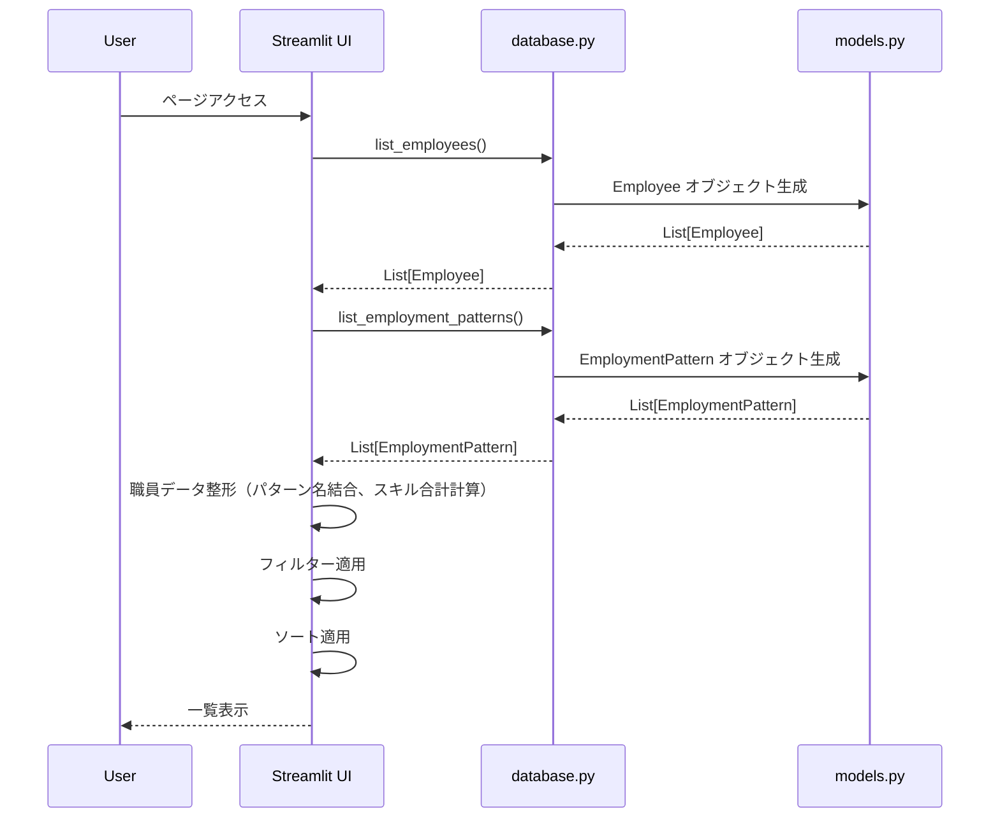
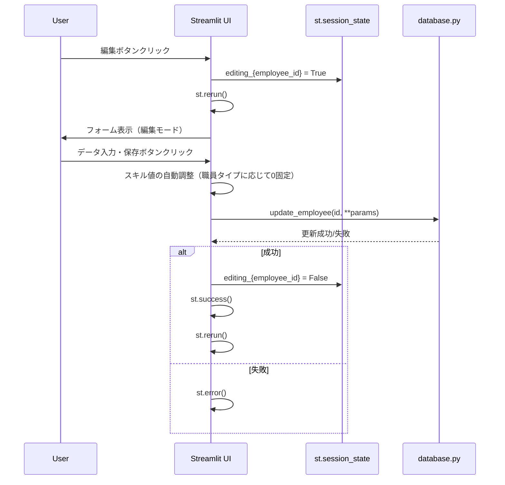
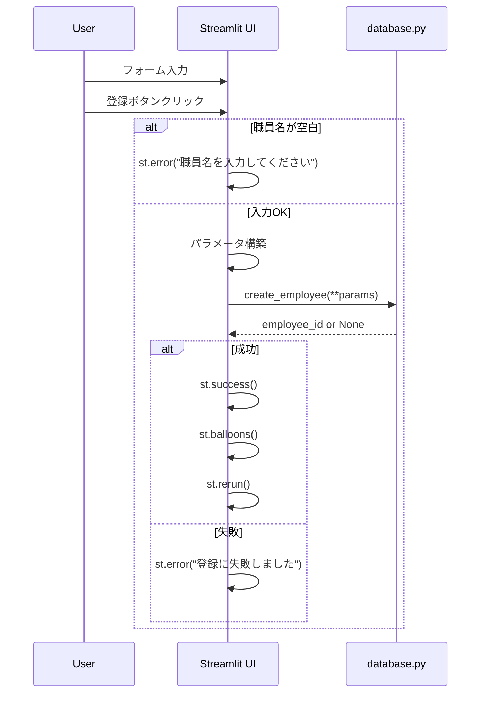
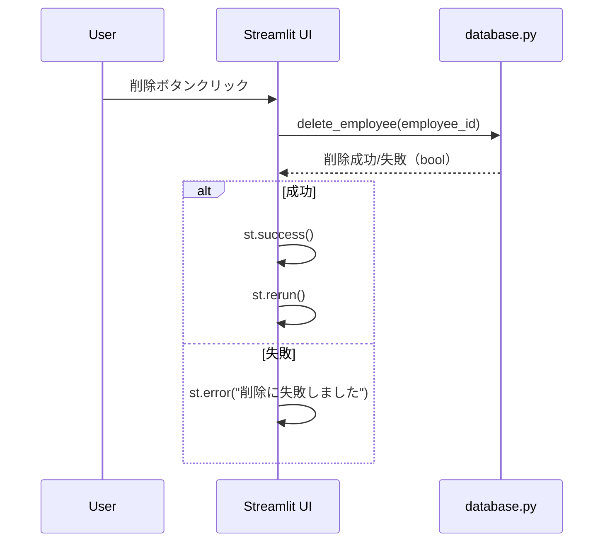

# 職員管理画面 詳細設計書

## 1. 画面概要

### 1.1 目的
職員の基本情報、職員タイプ、勤務形態、スキルスコアの登録・編集・削除を行う画面。

### 1.2 画面パス
- **ファイルパス**: `pages/1_👥_職員管理.py`
- **URL**: `/1_👥_職員管理`（Streamlitのページルーティング）

### 1.3 画面構成
- タブ1: 職員一覧
- タブ2: 新規登録
- サイドバー: ヘルプ情報

---

## 2. データモデル

### 2.1 Employee（職員）エンティティ

#### プロパティ

| 項目名 | 型 | 必須 | デフォルト | 制約 | 説明 |
|--------|-----|------|-----------|------|------|
| id | int | ○ | AUTO | PRIMARY KEY | 職員ID（自動採番） |
| name | str | ○ | - | NOT NULL | 職員名 |
| employee_type | str | ○ | TYPE_A | CHECK | 職員タイプ（TYPE_A/B/C/D） |
| employment_type | str | ○ | 正職員 | CHECK | 雇用形態（正職員/パート） |
| employment_pattern_id | str | - | None | FK | 勤務パターンID |
| skill_reha | int | ○ | 50 | 0-100 | リハ室スキル |
| skill_reception_am | int | ○ | 50 | 0-100 | 受付午前スキル |
| skill_reception_pm | int | ○ | 50 | 0-100 | 受付午後スキル |
| skill_general | int | ○ | 50 | 0-100 | 総合対応力 |
| is_active | bool | ○ | True | - | 有効フラグ |

#### 職員タイプの制約

| 職員タイプ | 配置可能エリア | 入力可能スキル |
|-----------|---------------|---------------|
| TYPE_A | リハ室・受付両方 | リハ室、受付AM、受付PM、総合 |
| TYPE_B | 受付のみ | 受付AM、受付PM、総合（リハ室は0固定） |
| TYPE_C | リハ室のみ（正職員） | リハ室、総合（受付系は0固定） |
| TYPE_D | リハ室のみ（パート） | リハ室、総合（受付系は0固定） |

### 2.2 EmploymentPattern（勤務パターン）エンティティ

#### プロパティ

| 項目名 | 型 | 必須 | 説明 |
|--------|-----|------|------|
| id | str | ○ | パターンID |
| name | str | ○ | パターン名 |
| category | str | ○ | カテゴリ（full_time/short_time/part_time） |
| start_time | str | ○ | 勤務開始時刻（HH:MM） |
| end_time | str | ○ | 勤務終了時刻（HH:MM） |
| break_hours | float | ○ | 休憩時間（時間） |
| work_hours | float | ○ | 実働時間（時間） |
| can_work_afternoon | bool | ○ | 午後勤務可否 |
| description | str | - | 説明 |

#### カテゴリと勤務パターンの関係

| カテゴリ | 雇用形態 | パターン例 |
|---------|---------|-----------|
| full_time | 正職員 | フルタイム（早番）、フルタイム（中番）、フルタイム（遅番） |
| short_time | 正職員 | 時短勤務 |
| part_time | パート | パート午前（早番）、パート午前、パート午前延長 |

---

## 3. 画面レイアウト

### 3.1 タブ1: 職員一覧

#### 3.1.1 フィルター・ソートエリア

**配置**: 4カラムレイアウト

| カラム | 項目 | タイプ | 選択肢 | デフォルト |
|--------|------|--------|--------|-----------|
| 1 | 職員タイプ | selectbox | 全て、リハ室・受付両方可能、受付のみ、リハ室のみ(正職員)、リハ室のみ(パート) | 全て |
| 2 | 雇用形態 | selectbox | 全て、正職員、パート | 全て |
| 3 | 勤務パターン | selectbox | 全て、[登録済みパターン名] | 全て |
| 4 | 並び順 | selectbox | 雇用形態・勤務パターン、スキルスコア(降順)、スキルスコア(昇順)、名前 | 雇用形態・勤務パターン |

#### 3.1.2 職員一覧テーブル

**配置**: 10カラムレイアウト（比率: 2:2:2:2:1:1:1:1:1:1.5）

| カラム | ヘッダー | 内容 | 表示モード |
|--------|---------|------|-----------|
| 1 | 名前 | 職員名 | text / text_input（編集時） |
| 2 | 職員タイプ | 職員タイプ（日本語表示） | text / selectbox（編集時） |
| 3 | 雇用形態 | 正職員/パート | text / selectbox（編集時） |
| 4 | 勤務パターン | パターン名と時間 | text / selectbox（編集時） |
| 5 | リハ室 | リハ室スキル | text / number_input（編集時） |
| 6 | 受付AM | 受付午前スキル | text / number_input（編集時） |
| 7 | 受付PM | 受付午後スキル | text / number_input（編集時） |
| 8 | 総合 | 総合対応力 | text / number_input（編集時） |
| 9 | 合計 | 4項目の合計値 | text（太字） |
| 10 | 操作 | 編集・削除ボタン | button |

**編集モードの動作**:
- 編集ボタン（✏️）クリック時: 該当行がフォームに切り替わる
- 保存ボタン（💾）: データを更新してリロード
- キャンセルボタン（❌）: 編集モードを解除してリロード
- 削除ボタン（🗑️）: 確認なしで即座に削除してリロード

**セッション状態管理**:
- `editing_{employee_id}`: 編集モードフラグ（bool）
- `pattern_cat_{employee_id}`: 勤務パターンカテゴリの一時保存

#### 3.1.3 統計情報エリア

**配置**: 4カラムレイアウト

| カラム | メトリック名 | 計算式 |
|--------|------------|--------|
| 1 | 総職員数 | 全職員数 |
| 2 | 正職員 | employment_type == '正職員'の数 |
| 3 | パート | employment_type == 'パート'の数 |
| 4 | 平均リハ室スキル | 全職員のskill_rehaの平均 |

### 3.2 タブ2: 新規登録

#### 3.2.1 入力フォーム

**フォームキー**: `employee_form`

| セクション | 項目 | タイプ | 必須 | 制約 | 初期値 | 備考 |
|-----------|------|--------|------|------|--------|------|
| 基本 | 職員名 | text_input | ○ | - | "" | プレースホルダー: "例: 山田太郎" |
| 基本情報 | 雇用形態 | radio | ○ | 正職員/パート | 正職員 | 2カラムの左 |
| 基本情報 | 職員タイプ | selectbox | ○ | TYPE_A/B/C/D | TYPE_A | 2カラムの右、日本語ラベル表示 |
| 基本情報 | 勤務区分 | radio | △ | full_time/short_time | full_time | 正職員の場合のみ表示 |
| 基本情報 | 勤務パターン | selectbox | ○ | カテゴリに応じた選択肢 | 先頭のパターン | format_func で時間表示 |
| スキル | リハ室スキル | number_input | ○ | 0-100 | 0 | TYPE_Bは無効化 |
| スキル | 受付午前スキル | number_input | ○ | 0-100 | 0 | TYPE_C/Dは無効化 |
| スキル | 受付午後スキル | number_input | ○ | 0-100 | 0 | TYPE_C/Dは無効化 |
| スキル | 総合対応力 | number_input | ○ | 0-100 | 0 | 常に有効 |

**勤務パターンの選択ロジック**:
```python
if employment_type == "正職員":
    pattern_category = radio("勤務区分", ["full_time", "short_time"])
else:
    pattern_category = "part_time"

pattern_candidates = [p for p in EMPLOYMENT_PATTERNS if p.category == pattern_category]
```

#### 3.2.2 登録ボタン

- **ラベル**: "✅ 登録"
- **タイプ**: primary
- **幅**: use_container_width=True
- **バリデーション**: 職員名が空白の場合はエラー表示

### 3.3 サイドバー: ヘルプ

#### 3.3.1 エキスパンダー構成

| エキスパンダー名 | 内容 |
|----------------|------|
| 職員タイプについて | TYPE_A/B/C/Dの説明と配置可能エリア |
| スキルスコアについて | 4項目のスキルの説明と評価方法 |
| 勤務パターンについて | 勤務パターンの概要説明 |

---

## 4. データフロー

### 4.1 職員一覧表示フロー



### 4.2 職員編集フロー



### 4.3 職員新規登録フロー



### 4.4 職員削除フロー



---

## 5. ビジネスロジック

### 5.1 スキル入力制御ロジック

職員タイプに応じて、入力できないスキル項目を無効化（0固定）する。

```python
def get_skill_constraints(employee_type: str) -> dict:
    """職員タイプに応じたスキル制約を返す"""
    if employee_type == "TYPE_A":
        return {
            'skill_reha': {'disabled': False},
            'skill_reception_am': {'disabled': False},
            'skill_reception_pm': {'disabled': False},
            'skill_general': {'disabled': False}
        }
    elif employee_type == "TYPE_B":
        return {
            'skill_reha': {'disabled': True, 'value': 0},
            'skill_reception_am': {'disabled': False},
            'skill_reception_pm': {'disabled': False},
            'skill_general': {'disabled': False}
        }
    elif employee_type in ["TYPE_C", "TYPE_D"]:
        return {
            'skill_reha': {'disabled': False},
            'skill_reception_am': {'disabled': True, 'value': 0},
            'skill_reception_pm': {'disabled': True, 'value': 0},
            'skill_general': {'disabled': False}
        }
```

**適用タイミング**:
- 新規登録フォーム: number_inputのdisabledパラメータ
- 編集フォーム: number_inputのdisabledパラメータ
- 保存時: 無効化された項目は明示的に0を設定

### 5.2 勤務パターン選択ロジック

雇用形態に応じて選択可能な勤務パターンカテゴリを制限する。

```python
def get_available_pattern_category(employment_type: str) -> list:
    """雇用形態に応じた選択可能カテゴリを返す"""
    if employment_type == "正職員":
        return ["full_time", "short_time"]
    else:  # パート
        return ["part_time"]
```

**フィルタリング**:
```python
pattern_candidates = [
    p for p in EMPLOYMENT_PATTERNS 
    if p.category == pattern_category
]
```

### 5.3 フィルター・ソートロジック

#### 5.3.1 フィルター処理

```python
filtered_data = employee_data

# 職員タイプフィルター
if filter_employee_type != "全て":
    filtered_data = [e for e in filtered_data if e['employee_type'] == filter_employee_type]

# 雇用形態フィルター
if filter_employment_type != "全て":
    filtered_data = [e for e in filtered_data if e['employment_type'] == filter_employment_type]

# 勤務パターンフィルター
if filter_pattern != "全て":
    filtered_data = [e for e in filtered_data if e['pattern_name'] == filter_pattern]
```

#### 5.3.2 ソート処理

```python
if sort_by == "スキルスコア(降順)":
    filtered_data.sort(key=lambda x: x['total_skill'], reverse=True)
elif sort_by == "スキルスコア(昇順)":
    filtered_data.sort(key=lambda x: x['total_skill'])
elif sort_by == "名前":
    filtered_data.sort(key=lambda x: x['name'])
else:  # 雇用形態・勤務パターン
    filtered_data.sort(key=lambda x: (x['employment_type'], x['pattern_id'], x['name']))
```

### 5.4 データ整形ロジック

一覧表示用のデータ構造を生成する。

```python
employee_data = []
for emp in employees:
    pattern = PATTERN_LOOKUP.get(emp.employment_pattern_id)
    pattern_name = pattern.name if pattern else "未設定"
    pattern_time = f"{pattern.start_time}-{pattern.end_time}" if pattern else "-"
    pattern_category = pattern.category if pattern else "unknown"
    total_skill = emp.skill_reha + emp.skill_reception_am + emp.skill_reception_pm + emp.skill_general
    
    employee_data.append({
        'id': emp.id,
        'name': emp.name,
        'employee_type': emp.employee_type,
        'employment_type': emp.employment_type,
        'pattern_name': pattern_name,
        'pattern_time': pattern_time,
        'pattern_id': emp.employment_pattern_id or '',
        'pattern_category': pattern_category,
        'skill_reha': emp.skill_reha,
        'skill_reception_am': emp.skill_reception_am,
        'skill_reception_pm': emp.skill_reception_pm,
        'skill_general': emp.skill_general,
        'total_skill': total_skill
    })
```

---

## 6. UI/UXの詳細

### 6.1 表示ラベルの変換

#### 6.1.1 職員タイプの表示

| 内部値 | 一覧画面表示 | フルラベル（selectbox） |
|--------|------------|----------------------|
| TYPE_A | リハ室・受付両方 | 🌟 TYPE_A (リハ室・受付両方可能) |
| TYPE_B | 受付のみ | 📋 TYPE_B (受付のみ) |
| TYPE_C | リハ室のみ(正) | 💪 TYPE_C (リハ室のみ・正職員) |
| TYPE_D | リハ室のみ(パ) | 🏃 TYPE_D (リハ室のみ・パート) |

#### 6.1.2 カテゴリの表示

| 内部値 | 日本語表示 |
|--------|-----------|
| full_time | フルタイム |
| short_time | 時短勤務 |
| part_time | パートタイム |

### 6.2 アイコンの使用

| 用途 | アイコン | 意味 |
|------|---------|------|
| 編集ボタン | ✏️ | 編集モード切替 |
| 保存ボタン | 💾 | データ保存 |
| キャンセルボタン | ❌ | 編集キャンセル |
| 削除ボタン | 🗑️ | データ削除 |
| 登録ボタン | ✅ | 新規登録 |

### 6.3 メッセージ表示

| タイプ | 使用場面 | メッセージ例 |
|--------|---------|------------|
| success | 登録成功 | "✅ 山田太郎さんを登録しました（ID: 1）" |
| success | 更新成功 | "✅ 山田太郎さんの情報を更新しました" |
| success | 削除成功 | "✅ 山田太郎さんを削除しました" |
| error | 登録失敗 | "❌ 職員名を入力してください" |
| error | 更新失敗 | "更新に失敗しました" |
| error | 削除失敗 | "削除に失敗しました" |
| info | 職員なし | "📝 職員が登録されていません。「新規登録」タブから登録してください。" |
| warning | フィルター結果なし | "🔍 該当する職員が見つかりませんでした。" |
| warning | パターンなし | "⚠️ 選択可能な勤務パターンがありません" |

### 6.4 インタラクション

#### 6.4.1 編集モードの切り替え

1. 通常表示モード → 編集モード
   - 編集ボタン（✏️）クリック
   - セッション状態: `editing_{employee_id} = True`
   - ページリロード（st.rerun()）

2. 編集モード → 通常表示モード
   - 保存ボタン（💾）クリック → 更新成功後
   - キャンセルボタン（❌）クリック
   - セッション状態: `editing_{employee_id} = False`
   - ページリロード（st.rerun()）

#### 6.4.2 新規登録時のフィードバック

- 登録成功時: 
  - 成功メッセージ表示
  - バルーンアニメーション（st.balloons()）
  - ページリロード

---

## 7. データベース操作

### 7.1 使用する関数

| 関数名 | モジュール | 用途 | 引数 | 戻り値 |
|--------|----------|------|------|--------|
| list_employees | database.py | 職員一覧取得 | active_only: bool = True | List[Employee] |
| get_employee | database.py | 職員取得 | employee_id: int | Optional[Employee] |
| create_employee | database.py | 職員作成 | name, employee_type, employment_type, employment_pattern_id, skill_* | int (employee_id) |
| update_employee | database.py | 職員更新 | employee_id: int, **fields | bool |
| delete_employee | database.py | 職員削除 | employee_id: int | bool |
| list_employment_patterns | database.py | 勤務パターン一覧 | category: Optional[str] = None | List[EmploymentPattern] |
| get_employment_pattern | database.py | 勤務パターン取得 | pattern_id: str | Optional[EmploymentPattern] |

### 7.2 トランザクション

- **新規登録**: 単一INSERT、自動コミット
- **更新**: 単一UPDATE、自動コミット
- **削除**: 単一DELETE、自動コミット（CASCADE制約により関連データも削除）

### 7.3 データ整合性

#### 外部キー制約
- `employees.employment_pattern_id` → `employment_patterns.id`
  - ON DELETE: SET NULL（暗黙的）
  - ON UPDATE: CASCADE（暗黙的）

#### CHECK制約
- `employee_type`: IN ('TYPE_A', 'TYPE_B', 'TYPE_C', 'TYPE_D')
- `employment_type`: IN ('正職員', 'パート')
- `skill_*`: BETWEEN 0 AND 100

---

## 8. エラーハンドリング

### 8.1 バリデーション

| 項目 | チェック内容 | エラーメッセージ |
|------|------------|----------------|
| 職員名 | 空白チェック | "❌ 職員名を入力してください" |
| スキルスコア | 0-100範囲 | Streamlitのnumber_inputで制御（UIレベル） |

### 8.2 データベースエラー

| エラー種別 | 発生場面 | ハンドリング |
|-----------|---------|-------------|
| 登録失敗 | create_employee() | "登録に失敗しました"を表示 |
| 更新失敗 | update_employee() | "更新に失敗しました"を表示 |
| 削除失敗 | delete_employee() | "削除に失敗しました"を表示 |

### 8.3 セッション状態の管理

- 編集モードフラグは職員ごとに独立
- ページリロード時にクリーンアップは不要（Streamlitが自動管理）

---

## 9. パフォーマンス

### 9.1 データ取得の最適化

- 職員一覧: 1回のクエリで全件取得（`list_employees()`）
- 勤務パターン: 1回のクエリで全件取得（`list_employment_patterns()`）
- パターンルックアップ: 辞書化してO(1)アクセス

```python
PATTERN_LOOKUP = {pattern.id: pattern for pattern in EMPLOYMENT_PATTERNS}
```

### 9.2 レンダリングの最適化

- フィルター・ソート後のデータのみレンダリング
- 編集モード時は該当行のみフォーム化
- セッション状態を使った編集モード管理で不要な再レンダリングを防止

---

## 10. セキュリティ

### 10.1 入力サニタイゼーション

- 職員名: `name.strip()` で前後の空白を除去
- その他の入力: Streamlitのコンポーネントで型保証

### 10.2 SQLインジェクション対策

- パラメータ化クエリを使用（database.py内で実装）
- ORMは使用せず、SQLiteのパラメータバインディングで対応

---

## 11. テスト観点

### 11.1 機能テスト

| テストケース | 入力 | 期待結果 |
|------------|------|---------|
| 正常登録（TYPE_A） | 全項目入力 | 登録成功、ID採番 |
| 正常登録（TYPE_B） | リハ室スキル無効 | 登録成功、リハ室スキル=0 |
| 正常登録（TYPE_C） | 受付スキル無効 | 登録成功、受付スキル=0 |
| 正常登録（TYPE_D） | 受付スキル無効 | 登録成功、受付スキル=0 |
| 職員名未入力 | 空白 | エラーメッセージ表示 |
| 編集→保存 | 名前変更 | 更新成功 |
| 編集→キャンセル | - | 編集前の状態に戻る |
| 削除 | 職員ID指定 | 削除成功 |

### 11.2 UIテスト

| テストケース | 操作 | 期待結果 |
|------------|------|---------|
| フィルター（職員タイプ） | TYPE_A選択 | TYPE_Aのみ表示 |
| フィルター（雇用形態） | 正職員選択 | 正職員のみ表示 |
| フィルター（勤務パターン） | 特定パターン選択 | 該当パターンのみ表示 |
| ソート（スキル降順） | スキルスコア(降順)選択 | スキル高い順に並び替え |
| ソート（スキル昇順） | スキルスコア(昇順)選択 | スキル低い順に並び替え |
| ソート（名前） | 名前選択 | 50音順に並び替え |

### 11.3 データ整合性テスト

| テストケース | 操作 | 期待結果 |
|------------|------|---------|
| スキル制約（TYPE_B） | TYPE_B選択時にリハ室スキル入力 | リハ室スキル入力欄が無効化 |
| スキル制約（TYPE_C） | TYPE_C選択時に受付スキル入力 | 受付スキル入力欄が無効化 |
| 勤務パターン連動 | 雇用形態変更 | 選択可能パターンが更新 |

---

## 12. 今後の拡張予定

### 12.1 機能追加候補

- [ ] 職員のインポート/エクスポート機能（CSV/Excel）
- [ ] 職員の無効化機能（削除ではなくis_active=Falseに変更）
- [ ] 職員の検索機能（名前での部分一致検索）
- [ ] スキルスコアの一括更新機能
- [ ] 職員の複製機能

### 12.2 UI/UX改善候補

- [ ] 削除時の確認ダイアログ
- [ ] 編集中の他の行を自動的に表示モードに戻す
- [ ] ページネーション（職員数が多い場合）
- [ ] スキルスコアのビジュアル表示（プログレスバー等）

---

## 13. 関連ドキュメント

- [要求事項定義書](../docs/REQUIREMENTS.md)
- [アーキテクチャ設計書](../docs/ARCHITECTURE.md)
- [データベース設計](../docs/ARCHITECTURE.md#4-データモデル設計-v30)

---

**作成日**: 2025年12月8日  
**バージョン**: 1.0  
**作成者**: システム開発チーム
